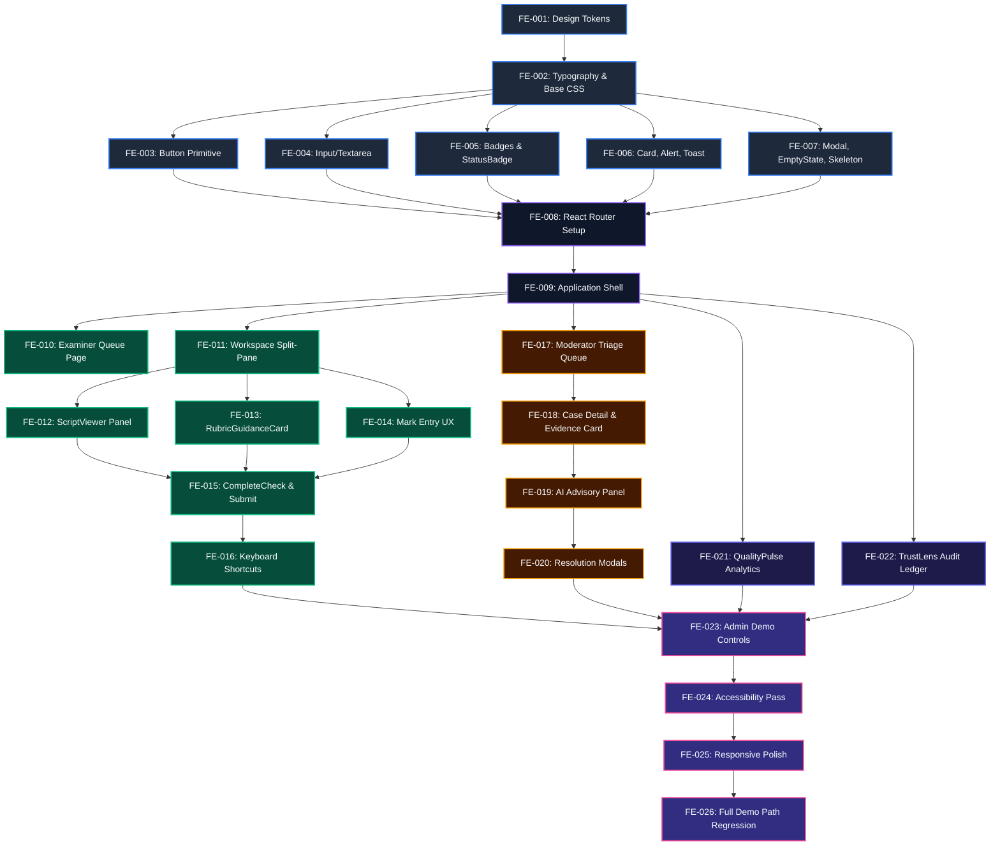

# OSM Frontend Redesign — Build Plan

**Document:** `docs/12-frontend-redesign-build-plan.md`
**Status:** AUTHORITATIVE ENGINEERING PLAN
**Design Source:** `docs/11-frontend-design-contract.md` (LOCKED)
**Constraint:** Backend (`apps/api/`, `packages/shared/`, SQLite, API routes, DTOs) is FROZEN.
**Execution Rule:** One task at a time. Stop after each task. Await authorization before proceeding.

---

## PART 1 — CURRENT BASELINE

### 1.1 Current Architecture

The OSM frontend is a single-page React 19 application built with Vite and TypeScript.

**Entry:** `apps/web/src/main.tsx` → `App.tsx`

**Routing:** None. Navigation is implemented as a single `activeTab` state variable in `App.tsx` with conditional rendering. No React Router or equivalent is installed.

**State management:** React `useState`/`useEffect` only. No global state manager (Zustand, Redux, Context API). Auth context is passed top-down via props.

**Styling:** Single large CSS file: `apps/web/src/styles/index.css` (2,791 lines). Dark developer aesthetic using `#0b0f19` backgrounds, indigo/pink gradients, glowing shadows, and implementation-phase labels.

### 1.2 Current Screens

| Tab Label | Component | File | Purpose |
| :--- | :--- | :--- | :--- |
| "P0: Foundation Baseline" | Inline JSX in App.tsx | App.tsx:216–312 | Static feature cards + health panel |
| "Evaluation Workspace (P2)" | EvaluationWorkspace | components/evaluation/EvaluationWorkspace.tsx | Mark entry, CompleteCheck, submit |
| "EscalationHub / Triage (P5)" | EscalationHub | components/escalation/EscalationHub.tsx | Triage queue + case management |
| "QualityPulse Analytics (P8)" | QualityPulseDashboard | components/analytics/QualityPulseDashboard.tsx | Analytics dashboard |
| "TrustLens & Audit (P6)" | TrustLensView | components/audit/TrustLensView.tsx | Audit event timeline |

### 1.3 Current Components

`apps/web/src/components/`

`
common/
  RoleSwitcher.tsx            (1.7KB) — role/actorId selector, labeled "DEMO ACTOR SIMULATOR"
evaluation/
  EvaluationWorkspace.tsx    (16.2KB) — mark entry, completeness check, submit; hardcoded to eval-demo-incomplete
escalation/
  EscalationHub.tsx           (8.1KB) — top-level moderator view wrapper
  TriageQueue.tsx             (8.5KB) — list of triage cases
  TriageCaseDetail.tsx       (15.0KB) — case detail + assignment + resolution + AI advisory
  AssignCaseModal.tsx         (4.6KB) — assign case modal
  ResolutionModal.tsx         (7.7KB) — resolution recording modal
analytics/
  QualityPulseDashboard.tsx  (21.6KB) — quality pulse main dashboard
  HotspotDrillDownModal.tsx   (3.8KB) — hotspot detail modal
  SentinelTriggerModal.tsx    (7.2KB) — sentinel trigger confirmation
audit/
  TrustLensView.tsx           (9.0KB) — audit event timeline
`

### 1.4 Current Services

`apps/web/src/services/`

`
api-client.ts      (2.8KB) — Base ApiClient class; GET/POST/PATCH; auth headers; ApiError class
ai-service.ts      (0.6KB) — POST /ai/advisory wrapper
analytics-service.ts (4.3KB) — GET /analytics/quality-pulse, /hotspots, trigger-sentinel, /evaluators, /summary
demo-service.ts    (0.6KB) — POST /demo/seed, /demo/reset
triage-service.ts  (2.3KB) — GET/POST /triage-cases, /quality-signals
`

No evaluation-specific service file exists. Evaluation API calls are made directly in `EvaluationWorkspace.tsx` using `apiClient.get`/`apiClient.patch`/`apiClient.post`.

### 1.5 Current API Dependencies

| Operation | Method | Endpoint | Used By |
| :--- | :--- | :--- | :--- |
| Health check | GET | /health | App.tsx |
| Evaluation detail | GET | /evaluations/:id | EvaluationWorkspace |
| Completeness check | GET | /evaluations/:id/completeness | EvaluationWorkspace |
| Mark assignment | PATCH | /evaluations/:id | EvaluationWorkspace |
| Evaluation submit | POST | /evaluations/:id/submit | EvaluationWorkspace |
| Triage case list | GET | /triage-cases | TriageQueue |
| Triage case detail | GET | /triage-cases/:id | TriageCaseDetail |
| Assign case | POST | /triage-cases/:id/assign | AssignCaseModal |
| Resolve case | POST | /triage-cases/:id/resolve | ResolutionModal |
| Quality signal | GET | /quality-signals/:id | TriageCaseDetail |
| AI advisory | POST | /ai/advisory | TriageCaseDetail |
| Quality pulse | GET | /analytics/quality-pulse | QualityPulseDashboard |
| Evaluator analytics | GET | /analytics/evaluators | QualityPulseDashboard |
| Analytics summary | GET | /analytics/summary | QualityPulseDashboard |
| Trigger sentinel | POST | /analytics/quality-pulse/trigger-sentinel | SentinelTriggerModal |
| Audit events | GET | /audit-events | TrustLensView |
| Demo seed | POST | /demo/seed | App.tsx |
| Demo reset | POST | /demo/reset | App.tsx |

### 1.6 Major UX Deficiencies

1. **No role-specific navigation.** EXAMINER sees all tabs including 403-protected Triage/Analytics/Audit. The frontend does not prevent navigation to unauthorized screens.
2. **Implementation-phase labels visible to users.** Tab labels: "P0: Foundation Baseline", "Evaluation Workspace (P2)", "EscalationHub / Triage (P5)", "QualityPulse Analytics (P8)".
3. **No evaluation queue.** Examiners have no way to discover assigned scripts. `EvaluationWorkspace` is hardcoded to `eval-demo-incomplete`.
4. **No script viewer.** The evaluation workspace shows only mark entry inputs. There is no view of the student's actual answers.
5. **No rubric guidance.** There is no mark band guidance panel for examiners during marking.
6. **Tab-based navigation.** No URL routing; browser back/forward does not work; no deep linking; bookmarking impossible.
7. **Dark crypto aesthetic.** The visual design (dark backgrounds, glowing borders, neon gradients) is entirely wrong for an academic examination platform.
8. **Raw backend identifiers visible.** Evaluation IDs, actor IDs, and UUIDs are displayed directly to users.
9. **All roles see all tabs.** EXAMINER should not see Triage, Analytics, or Audit. No role-boundary enforcement exists in the UI.
10. **"DEMO ACTOR SIMULATOR" label.** Internal engineering label visible in the user interface.
11. **No split-pane workspace.** The evaluation workspace is a single-column vertical form, not a professional marking interface.
12. **Statistical evidence not displayed visually.** The evidence in triage cases is rendered as raw JSON or minimal text, not as a structured evidence card.

### 1.7 Known Data Limitations

- **No script document storage in backend.** `scriptId` exists as a reference, but there is no API endpoint that returns student answer content. The script viewer must use static frontend fixtures keyed by `scriptId`.
- **No rubric text in API.** `rubricCriteriaId` is stored but rubric criterion descriptions (mark bands) are not served by the backend. Rubric guidance must use static frontend fixtures keyed by `rubricCriteriaId`.
- **No actor display names in API.** The audit event `actorId` field is a raw identifier (e.g., `evaluator_1`). Display names must be a frontend-only mapping fixture.
- **No human-readable script references in API.** `SCRIPT-DEMO-101` must be mapped to a human-readable barcode (`OSM-2026-CS101-0101`) via a frontend fixture.

### 1.8 Frozen Backend Boundary

**ZERO modifications permitted to:**

- `apps/api/` — All API, domain, infrastructure files
- `packages/shared/` — All DTOs, enums, shared types
- SQLite database schema or migrations
- API route URLs, HTTP methods, or status codes
- Domain invariants, RBAC rules, or authorization behavior
- AI authority boundaries

**Frontend-only changes permitted to:**

- `apps/web/src/` — All React components, CSS, services, fixtures
- `apps/web/` — Vite config, package.json (only for frontend dependencies)

---

## PART 2 — IMPLEMENTATION STRATEGY

### 2.1 Guiding Principle

Each phase must leave the application in a runnable, demo-able state. No phase should break the existing backend integration. All API calls must continue to use the same auth headers, endpoints, and request payloads they use today.

The strategy is additive-first: build the new shell alongside the existing code, then migrate screens one at a time, then remove old code.

### 2.2 Dependency-Ordered Phases

`
PHASE 0 — Design Foundation
  Establish design tokens, typography, base styles
  (Foundation for all visual work)
  ↓
PHASE 1 — Primitive Components
  Build reusable atomic components
  (Required by all screens)
  ↓
PHASE 2 — Application Shell + Routing
  Install React Router, build sidebar + header, implement role-based navigation
  (Gate for all role-specific screens)
  ↓
PHASE 3 — Examiner Queue
  Build the Script Inbox page (new screen — no equivalent exists)
  ↓
PHASE 4 — Evaluation Workspace Redesign
  Refactor EvaluationWorkspace into split-pane layout
  ↓
PHASE 5 — Script Viewer
  Build ScriptViewerPanel with demo fixture data
  ↓
PHASE 6 — Rubric Guidance + Mark UX
  Build RubricGuidanceCard, refine mark entry, save indicator
  ↓
PHASE 7 — CompleteCheck + Submit Flow
  Redesign persistent CompleteCheck bar and submission modal
  ↓
PHASE 8 — Moderator Triage Redesign
  Refactor TriageQueue + TriageCaseDetail to new design system
  ↓
PHASE 9 — AI Advisory Panel
  Redesign AI advisory within triage case detail
  ↓
PHASE 10 — QualityPulse Redesign
  Refactor QualityPulseDashboard to new design system
  ↓
PHASE 11 — TrustLens Redesign
  Refactor TrustLensView to new design system with human-readable content
  ↓
PHASE 12 — Admin Controls
  Redesign Demo Seed/Reset controls for ADMIN role
  ↓
PHASE 13 — Accessibility Pass
  WCAG 2.1 AA review: focus rings, ARIA labels, keyboard nav
  ↓
PHASE 14 — Responsive Polish
  Breakpoint verification, mobile fallbacks
  ↓
PHASE 15 — Regression Verification
  End-to-end demo path walkthrough, API contract verification
`

### 2.3 P0 / P1 / P2 Phase Mapping

| Priority | Phases |
| :--- | :--- |
| **P0 — Demo critical** | 0, 1, 2, 3, 4, 5, 6, 7 |
| **P1 — Important** | 8, 9, 10, 11, 12 |
| **P2 — Polish** | 13, 14, 15 |

---

## PART 3 — TASK DECOMPOSITION

---

### FE-001 — Establish Design Tokens

**Phase:** 0 — Design Foundation
**Priority:** P0

**Objective:** Replace the current dark developer CSS token system with the institutional OSM token system defined in the design contract (Section 2).

**Why It Exists:** Every subsequent visual change depends on a consistent, correct token set. Without this foundation, colors, spacing, and typography will be inconsistent across components.

**Dependencies:** None

**Files Likely Affected:**
- `apps/web/src/styles/index.css` — REPLACE entire :root token block

**Files That MUST NOT Be Modified:**
- `apps/api/` (any)
- `packages/shared/` (any)

**Implementation Scope:**
1. Replace the `:root` block with the new `--osm-*` token system
2. Keep the existing file structure; only replace token definitions
3. Add Google Fonts `<link>` in `apps/web/index.html` for Inter, IBM Plex Sans, IBM Plex Mono
4. Set base `body` styles: background `--osm-bg-page`, color `--osm-text-primary`, font `--osm-font-body`
5. Remove: `--bg-primary: #0b0f19`, gradient body backgrounds, `--accent-gradient`, glow shadows
6. Remove body `background-image` with radial gradients

**Acceptance Criteria:**
- `:root` exports all `--osm-*` tokens documented in design contract §2
- `body` renders white/off-white background (not dark)
- Google Fonts loaded in index.html
- Existing components may look broken visually — this is expected and acceptable at this stage
- No backend API calls changed
- TypeScript compiles without error

**Validation Method:** Level 1 (TypeScript + lint) + Level 5 (visual inspection — confirm page background is light)

**Expected Output:** `index.css` with new token system and `index.html` with Google Fonts link

**Risk Level:** LOW

**Rollback:** Revert `index.css` changes with `git restore`

---

### FE-002 — Establish Base Typography and Layout Styles

**Phase:** 0 — Design Foundation
**Priority:** P0

**Objective:** Define the baseline CSS for typography scale, spacing utilities, and layout primitives.

**Why It Exists:** Components built in FE-003 onwards need a consistent set of base styles to reference.

**Dependencies:** FE-001

**Files Likely Affected:**
- `apps/web/src/styles/index.css` — Add typography classes, layout utilities

**Files That MUST NOT Be Modified:**
- `apps/api/` (any)
- `packages/shared/` (any)

**Implementation Scope:**
1. Implement CSS classes for the type scale tokens (`osm-t-page-title`, `osm-t-body`, etc.)
2. Implement base heading styles: `h1`, `h2`, `h3` using `--osm-font-heading`
3. Remove existing `.hero-title`, `.hero-subtitle`, `.brand-title` classes (or restyle them to use new tokens)
4. Implement `main#osm-main-content` layout: flex column, fill remaining height
5. Do NOT implement sidebar or shell layout yet (FE-008)
6. Clean up orphaned CSS classes from the old dark theme that are no longer needed

**Acceptance Criteria:**
- Application renders with correct typography family on all text elements
- Type scale CSS classes are defined and accessible
- No TypeScript errors

**Validation Method:** Level 1 + Level 5

**Expected Output:** Extended `index.css` with typography and base layout styles

**Risk Level:** LOW

**Rollback:** `git restore` the CSS additions

---

### FE-003 — Build Button Primitive

**Phase:** 1 — Primitive Components
**Priority:** P0

**Objective:** Create a reusable `Button` component with primary, secondary, ghost, and danger variants; sizes (sm, md, lg); loading and disabled states.

**Why It Exists:** Every interactive action in the application uses a button. Having one canonical component prevents duplication and ensures consistent hover/focus/loading states.

**Dependencies:** FE-001, FE-002

**Files Likely Affected:**
- `apps/web/src/components/ui/Button.tsx` — NEW FILE
- `apps/web/src/styles/index.css` — Button CSS classes

**Files That MUST NOT Be Modified:**
- `apps/api/` (any)
- `packages/shared/` (any)
- Existing screen components (do not migrate yet)

**Implementation Scope:**
1. Create `apps/web/src/components/ui/` directory
2. Implement `Button` with props: `variant` (primary | secondary | ghost | danger), `size` (sm | md | lg), `loading` (boolean), `disabled` (boolean), `onClick`, `type`, `id`, `children`
3. Loading state: shows inline spinner + disabled
4. Focus style: `--osm-border-focus` outline
5. All hover/active transitions ≤ 200ms
6. Minimum 44px height for md/lg sizes (accessibility)
7. No hardcoded hex values in the component; all colors from `--osm-*` tokens

**Acceptance Criteria:**
- Button renders in all 4 variants with correct colors
- Loading state disables button and shows spinner
- Focus outline visible (2px solid `--osm-border-focus`)
- TypeScript types correct, no `any`
- Not yet used by existing screens (safe to add without migration risk)

**Validation Method:** Level 1 + Level 5 (manual visual check of variants)

**Expected Output:** `components/ui/Button.tsx`

**Risk Level:** LOW

**Rollback:** Delete new file

---

### FE-004 — Build Input and Textarea Primitives

**Phase:** 1 — Primitive Components
**Priority:** P0

**Objective:** Create reusable `Input` (text/number) and `Textarea` components with label, error, help text, and disabled states.

**Dependencies:** FE-001, FE-002

**Files Likely Affected:**
- `apps/web/src/components/ui/Input.tsx` — NEW FILE
- `apps/web/src/components/ui/Textarea.tsx` — NEW FILE
- `apps/web/src/styles/index.css` — Input/Textarea CSS

**Files That MUST NOT Be Modified:** `apps/api/`, `packages/shared/`, existing screens

**Implementation Scope:**
1. `Input` props: `label`, `type` (text | number), `value`, `onChange`, `error`, `helpText`, `disabled`, `min`, `max`, `step`, `placeholder`, `id`, `maxLength`
2. `Textarea` props: `label`, `value`, `onChange`, `error`, `maxLength`, `rows`, `placeholder`, `disabled`, `id`
3. Character counter for `Textarea` when `maxLength` is provided
4. Error state: red border + error message below
5. `aria-describedby` linking input to error/help text
6. Focus ring: `--osm-border-focus`
7. Number input: minimum 80px wide × 44px tall

**Acceptance Criteria:**
- Both components render with label, error, and help text states
- Character counter works correctly
- `aria-describedby` present when error or helpText provided
- Focus ring visible
- TypeScript types correct

**Validation Method:** Level 1 + Level 5

**Expected Output:** `components/ui/Input.tsx`, `components/ui/Textarea.tsx`

**Risk Level:** LOW

**Rollback:** Delete new files

---

### FE-005 — Build Badge and StatusBadge Components

**Phase:** 1 — Primitive Components
**Priority:** P0

**Objective:** Create `Badge` (info/success/warning/danger/muted/ai variants) and `StatusBadge` (maps domain enum values to badge styles).

**Dependencies:** FE-001

**Files Likely Affected:**
- `apps/web/src/components/ui/Badge.tsx` — NEW FILE
- `apps/web/src/components/ui/StatusBadge.tsx` — NEW FILE
- `apps/web/src/styles/index.css` — Badge CSS

**Files That MUST NOT Be Modified:** `apps/api/`, `packages/shared/`

**Implementation Scope:**
1. `Badge` props: `variant` (info | success | warning | danger | muted | ai), `size` (sm | md), `children`, `aria-label`
2. `StatusBadge` accepts: `EvaluationStatus`, `TriageCaseStatus`, `QualitySignalStatus`, `SignalSeverity` from `@osm/shared` enums and renders the correct Badge variant + label
3. Badge color mapping:
   - info → `--osm-info-bg` / `--osm-info`
   - success → `--osm-success-bg` / `--osm-success`
   - warning → `--osm-warning-bg` / `--osm-warning`
   - danger → `--osm-danger-bg` / `--osm-danger`
   - muted → `--osm-bg-elevated` / `--osm-text-muted`
   - ai → `--osm-ai-label-bg` / `--osm-ai-text`
4. StatusBadge enum mapping:
   - `EvaluationStatus.DRAFT` → muted "Draft"
   - `EvaluationStatus.IN_PROGRESS` → info "In Progress"
   - `EvaluationStatus.SUBMITTED` → success "Submitted"
   - `EvaluationStatus.FINALIZED` → success "Finalized"
   - `TriageCaseStatus.OPEN` → warning "Open"
   - `TriageCaseStatus.ASSIGNED` → info "Assigned"
   - `TriageCaseStatus.UNDER_REVIEW` → info "Under Review"
   - `TriageCaseStatus.RESOLVED` → success "Resolved"
   - `TriageCaseStatus.ESCALATED` → danger "Escalated"
   - `SignalSeverity.CRITICAL` → danger "Critical"
   - `SignalSeverity.HIGH` → warning "High"
   - `SignalSeverity.MEDIUM` → muted "Medium"
   - `SignalSeverity.LOW` → muted "Low"

**Acceptance Criteria:**
- All badge variants render with correct background/text colors
- StatusBadge correctly maps all enum values
- `aria-label` prop passed through for accessibility
- TypeScript types correct, imports from `@osm/shared` used

**Validation Method:** Level 1 + Level 5

**Expected Output:** `components/ui/Badge.tsx`, `components/ui/StatusBadge.tsx`

**Risk Level:** LOW

**Rollback:** Delete new files

---

### FE-006 — Build Card, Alert, and Toast Components

**Phase:** 1 — Primitive Components
**Priority:** P0

**Objective:** Create surface/container primitives (Card), inline alert banners (Alert), and ephemeral notification (Toast + ToastContainer).

**Dependencies:** FE-001, FE-003

**Files Likely Affected:**
- `apps/web/src/components/ui/Card.tsx` — NEW FILE
- `apps/web/src/components/ui/Alert.tsx` — NEW FILE
- `apps/web/src/components/ui/Toast.tsx` — NEW FILE
- `apps/web/src/styles/index.css` — Card/Alert/Toast CSS

**Files That MUST NOT Be Modified:** `apps/api/`, `packages/shared/`

**Implementation Scope:**
1. `Card` props: `children`, `padding` (none | sm | md | lg), `elevated` (boolean), `flat` (boolean), `className`
2. `Alert` props: `type` (info | success | warning | error), `title` (optional), `message`, `dismissible` (boolean), `onDismiss`
3. `Toast` + `ToastContainer`:
   - Toast props: `id`, `type`, `message`, `duration` (ms, 0 = persistent)
   - `ToastContainer` renders stacked toasts in bottom-right corner
   - Auto-dismiss based on `duration`
   - Enter animation: slide-up 8px + opacity, 200ms
   - Exit animation: slide-down + opacity, 150ms
4. `Alert` uses `aria-live="assertive"` for error type, `aria-live="polite"` for others

**Acceptance Criteria:**
- Cards render with correct background and shadow
- Alert dismisses when `dismissible` + `onDismiss` provided
- Toast appears in bottom-right, auto-dismisses after duration
- `aria-live` regions correct
- Animations respect `prefers-reduced-motion`

**Validation Method:** Level 1 + Level 5

**Expected Output:** `components/ui/Card.tsx`, `components/ui/Alert.tsx`, `components/ui/Toast.tsx`

**Risk Level:** LOW

**Rollback:** Delete new files

---

### FE-007 — Build Modal, EmptyState, and Skeleton Primitives

**Phase:** 1 — Primitive Components
**Priority:** P0

**Objective:** Build a reusable modal dialog with focus trap, plus EmptyState and Skeleton loading placeholder components.

**Dependencies:** FE-001, FE-003

**Files Likely Affected:**
- `apps/web/src/components/ui/Modal.tsx` — NEW FILE
- `apps/web/src/components/ui/EmptyState.tsx` — NEW FILE
- `apps/web/src/components/ui/Skeleton.tsx` — NEW FILE
- `apps/web/src/styles/index.css` — Modal/EmptyState/Skeleton CSS

**Files That MUST NOT Be Modified:** `apps/api/`, `packages/shared/`

**Implementation Scope:**
1. `Modal` props: `title`, `open`, `onClose`, `size` (sm | md | lg), `footer` (ReactNode), `children`
   - Focus trap: when open, Tab cycles within modal; Esc closes
   - `role="dialog"`, `aria-modal="true"`, `aria-labelledby`
   - Backdrop click closes (optional prop to disable)
   - Open animation: scale 0.96 → 1.0 + opacity, 200ms
2. `EmptyState` props: `icon` (string emoji or component), `title`, `description`, `action` (ReactNode)
3. `Skeleton` props: `width`, `height`, `variant` (text | rectangle | circle), `className`
   - Shimmer animation: low-contrast left-to-right sweep, 1.5s infinite
   - Disabled when `prefers-reduced-motion` active

**Acceptance Criteria:**
- Modal focus trap works (Tab does not leave modal)
- Esc closes modal
- ARIA attributes correct
- Skeleton renders in all variants with shimmer
- EmptyState renders cleanly with optional action button
- TypeScript types correct

**Validation Method:** Level 1 + Level 5

**Expected Output:** `components/ui/Modal.tsx`, `components/ui/EmptyState.tsx`, `components/ui/Skeleton.tsx`

**Risk Level:** LOW

**Rollback:** Delete new files

---

### FE-008 — Install React Router and Define Route Structure

**Phase:** 2 — Application Shell + Routing
**Priority:** P0

**Objective:** Install React Router v6, define the route structure for EXAMINER, MODERATOR, and ADMIN roles, and set up the router in `main.tsx`/`App.tsx`.

**Why It Exists:** The current tab-based navigation cannot support role-specific page hiding, deep linking, or browser history. React Router is the standard for this in React applications and must be added before building the shell.

**Dependencies:** FE-001, FE-002

**Files Likely Affected:**
- `apps/web/package.json` — Add `react-router-dom`
- `apps/web/src/main.tsx` — Wrap with `<BrowserRouter>`
- `apps/web/src/App.tsx` — Convert from tab state to `<Routes>`

**Files That MUST NOT Be Modified:** `apps/api/`, `packages/shared/`, Vite config (unless needed for router base path)

**Implementation Scope:**
1. Install `react-router-dom` v6: `npm install react-router-dom` (in `apps/web`)
2. Wrap `App` in `<BrowserRouter>` in `main.tsx`
3. Define route tree (preserve existing component imports):
   `
   / → redirect to /examiner/queue (or role-appropriate default)
   /examiner/queue → ExaminerQueue (FE-010, placeholder page for now)
   /examiner/evaluate/:evalId → EvaluationWorkspace (existing, unwired for now)
   /moderator/triage → TriageQueue (existing)
   /moderator/triage/:caseId → TriageCaseDetail (existing)
   /moderator/analytics → QualityPulseDashboard (existing)
   /moderator/audit → TrustLensView (existing)
   /admin/overview → AdminOverview (FE-022, placeholder for now)
   /admin/analytics → QualityPulseDashboard (existing)
   /admin/audit → TrustLensView (existing)
   /admin/triage → TriageQueue (existing)
   /admin/demo → AdminDemoControls (FE-022, placeholder for now)
   `
4. Auth is still passed as props through a layout component (not React Context yet)
5. Role-gated redirect: if role doesn't match route prefix, redirect to role default
6. Current tab-based navigation in `App.tsx` removed

**Acceptance Criteria:**
- `/examiner/queue` renders (placeholder OK)
- `/moderator/triage` renders TriageQueue (existing component, same behavior)
- Browser back/forward works
- No regression in existing API calls
- TypeScript compiles

**Validation Method:** Level 1 + Level 3 (verify API calls still work after routing change)

**Expected Output:** Updated `main.tsx`, `App.tsx`, `package.json`

**Risk Level:** MEDIUM (touches App.tsx, routing change)

**Rollback:** Remove `react-router-dom`, revert `App.tsx` and `main.tsx`

---

### FE-009 — Build Application Shell (Header + Sidebar)

**Phase:** 2 — Application Shell + Routing
**Priority:** P0

**Objective:** Build the 64px sticky header and 240px sidebar layout components that form the institutional application shell.

**Dependencies:** FE-001 through FE-007, FE-008

**Files Likely Affected:**
- `apps/web/src/components/layout/AppShell.tsx` — NEW FILE
- `apps/web/src/components/layout/Header.tsx` — NEW FILE
- `apps/web/src/components/layout/Sidebar.tsx` — NEW FILE
- `apps/web/src/App.tsx` — Wrap content with AppShell
- `apps/web/src/styles/index.css` — Shell layout CSS

**Files That MUST NOT Be Modified:** `apps/api/`, `packages/shared/`

**Implementation Scope:**
1. `Header`: 64px sticky; left = OSM wordmark; right = Role indicator chip + DB status dot + API status dot
   - Role chip: labeled "[Role] Display Name" (e.g., "[Examiner] Dr. Sarah Jenkins")
   - Demo Role Switcher dropdown (replaces "DEMO ACTOR SIMULATOR" label)
   - Status dots: green/red circles, tooltip on hover
2. `Sidebar`: 240px fixed; role-specific nav items (from FE-010 map); active item highlighting; examination cycle label at bottom
3. `AppShell`: composes Header + Sidebar + main content area (`<main id="osm-main-content">`)
4. Role-specific nav items per Section 5 of design contract:
   - EXAMINER: My Script Queue, Evaluation Workspace
   - MODERATOR: Triage Queue, Quality Signals, QualityPulse Analytics, TrustLens Audit
   - ADMIN: System Overview, QualityPulse Analytics, TrustLens Audit, Triage Queue, Demo Controls
5. Display name fixture map (`// DEMO FIXTURE — Not from backend`): `evaluator_1` → "Dr. Sarah Jenkins" etc.
6. Health status (DB/API) moved from old header to new header dots

**Acceptance Criteria:**
- Header renders at 64px, sticky, with wordmark and role chip
- Sidebar renders with correct nav items for each role (switch role → nav items change)
- "DEMO ACTOR SIMULATOR" label is gone from the UI
- Phase labels ("P0: Foundation Baseline") are gone from navigation
- `<main id="osm-main-content">` wraps page content
- Existing components (TriageQueue, QualityPulseDashboard, etc.) still render when navigated to
- TypeScript compiles without error

**Validation Method:** Level 1 + Level 3 (verify API calls unaffected) + Level 5

**Expected Output:** `components/layout/AppShell.tsx`, `Header.tsx`, `Sidebar.tsx`

**Risk Level:** MEDIUM

**Rollback:** Remove layout components, revert `App.tsx`

---

### FE-010 — Build Examiner Script Queue Page

**Phase:** 3 — Examiner Queue
**Priority:** P0

**Objective:** Build the Script Inbox page for EXAMINER role: fetches assigned evaluations, displays them in a sortable table, links to Evaluation Workspace.

**Dependencies:** FE-001 through FE-009

**Files Likely Affected:**
- `apps/web/src/components/examiner/ExaminerQueue.tsx` — NEW FILE
- `apps/web/src/services/evaluation-service.ts` — NEW FILE (extract evaluation API calls from EvaluationWorkspace)
- `apps/web/src/fixtures/scriptReferences.ts` — NEW FILE (scriptId → human-readable mapping)
- `apps/web/src/styles/index.css` — Queue table CSS

**Files That MUST NOT Be Modified:** `apps/api/`, `packages/shared/`, `EvaluationWorkspace.tsx` (yet)

**Implementation Scope:**
1. Create `evaluation-service.ts` with:
   - `listEvaluations(query, auth)` → `GET /evaluations?evaluatorId=...`
   - `getEvaluation(id, auth)` → `GET /evaluations/:id`
   - `getCompleteness(id, auth)` → `GET /evaluations/:id/completeness`
   - `assignMark(id, body, auth)` → `PATCH /evaluations/:id`
   - `submitEvaluation(id, body, auth)` → `POST /evaluations/:id/submit`
2. `scriptReferences.ts` fixture: maps `SCRIPT-DEMO-101` → `{ displayRef: "OSM-2026-CS101-0101", candidateLabel: "Candidate #OSM-2026-CS101-0101" }`
3. `ExaminerQueue`: fetches `GET /evaluations?evaluatorId={auth.actorId}`, renders table
4. Table columns: Script Reference, Status (StatusBadge), Questions Marked (e.g., 2/3), Total Score, Last Updated (relative), Action button
5. Filter bar: Status filter select, search input
6. Loading: 5 skeleton rows
7. Empty state: "No scripts are currently assigned to your queue for this examination cycle."
8. "Mark Script" button links to `/examiner/evaluate/:evalId`; "View" button for SUBMITTED

**Acceptance Criteria:**
- Page renders with real API data (`GET /evaluations?evaluatorId=evaluator_1`)
- Status badges render correctly
- Human-readable script references (from fixture) displayed
- "Mark Script" link navigates correctly
- Filter and search work client-side (no extra API calls)
- Empty and loading states render
- TypeScript correct, no API contract changes

**Validation Method:** Level 1 + Level 3 (confirm API call shape correct) + Level 5

**Expected Output:** `components/examiner/ExaminerQueue.tsx`, `services/evaluation-service.ts`, `fixtures/scriptReferences.ts`

**Risk Level:** LOW (new page, no existing component modified)

**Rollback:** Delete new files; remove route

---

### FE-011 — Evaluation Workspace — Split-Pane Layout

**Phase:** 4 — Evaluation Workspace Redesign
**Priority:** P0

**Objective:** Refactor `EvaluationWorkspace.tsx` from a single-column form into a split-pane layout (55% script viewer / 45% marking panel) with the new design system.

**Dependencies:** FE-001 through FE-010

**Files Likely Affected:**
- `apps/web/src/components/evaluation/EvaluationWorkspace.tsx` — REFACTOR
- `apps/web/src/styles/index.css` — Workspace layout CSS

**Files That MUST NOT Be Modified:** `apps/api/`, `packages/shared/`, `evaluation-service.ts` API calls

**Implementation Scope:**
1. Preserve ALL existing API calls (`getEvaluation`, `getCompleteness`, `assignMark`, `submitEvaluation`) with identical request payloads — only the visual layout changes
2. Extract evaluation fetching to use the new `evaluation-service.ts` created in FE-010
3. Build split-pane layout:
   - Left pane (55%): ScriptViewerPanel placeholder (FE-012 fills this in)
   - Right pane (45%): Question Navigator + Marking Panel
4. Workspace header: script reference (from fixture), status badge, live score, course/cycle labels, version
5. Question Navigator tab strip: Q1/Q2/Q3 with status circles
6. Active question state: `activeQuestionIndex` syncs both panes
7. Route: accepts `evalId` param from URL (`/examiner/evaluate/:evalId`); falls back to `eval-demo-incomplete` if none
8. Remove hardcoded `eval-demo-incomplete` default in favor of URL param with fallback

**Acceptance Criteria:**
- Split pane renders correctly
- `GET /evaluations/:id` called with correct `evalId`
- Question Navigator tab switches between questions
- Auth headers unchanged (`x-user-role`, `x-actor-type`, `x-actor-id`)
- `expectedVersion` still sent in all PATCH calls
- Completeness check still called
- TypeScript correct

**Validation Method:** Level 1 + Level 3 (verify PATCH payload still includes `questionId`, `awardedMarks`, `expectedVersion`) + Level 5

**Expected Output:** Refactored `EvaluationWorkspace.tsx`

**Risk Level:** HIGH (modifies existing functional component)

**Rollback:** `git restore` the component file

---

### FE-012 — Build ScriptViewerPanel with Demo Fixtures

**Phase:** 5 — Script Viewer
**Priority:** P0

**Objective:** Build the `ScriptViewerPanel` component with demo fixture content keyed by `scriptId`, including the demo mode banner and question-synchronized scrolling.

**Dependencies:** FE-001 through FE-011

**Files Likely Affected:**
- `apps/web/src/components/evaluation/ScriptViewerPanel.tsx` — NEW FILE
- `apps/web/src/fixtures/scriptFixtures.ts` — NEW FILE
- `apps/web/src/styles/index.css` — ScriptViewer CSS

**Files That MUST NOT Be Modified:** `apps/api/`, `packages/shared/`

**Implementation Scope:**
1. `scriptFixtures.ts`: static lookup map:
   `	ypescript
   // DEMO FIXTURE — Not from backend
   export const SCRIPT_FIXTURES: Record<string, ScriptFixture> = {
     "SCRIPT-DEMO-101": { ... },
     "SCRIPT-DEMO-201": { ... },
     "SCRIPT-DEMO-501": { ... },
   }
   `
   Each fixture contains: `candidateRef`, `module`, `cycle`, `questions: Array<{ id, questionNumber, answerText }>`
2. `ScriptViewerPanel` props: `scriptId`, `activeQuestionIndex`, `onQuestionSectionClick`
3. Demo mode banner: "i Demonstration Mode — Anonymized Script Fixture" (`--osm-info-bg` background)
4. Question sections rendered vertically with separators
5. Active question section highlighted with `--osm-primary-subtle`
6. Scroll to active section when `activeQuestionIndex` changes (`scrollIntoView`)
7. If `scriptId` not in fixtures: show "Script document retrieval is not configured for this environment."
8. All fixture text marked with `// DEMO FIXTURE — Not from backend` comment at definition

**Acceptance Criteria:**
- Correct fixture displayed for SCRIPT-DEMO-101
- Demo mode banner always visible when fixture data is shown
- Active section highlights when navigator changes question
- Scroll behavior correct
- Unknown scriptId shows production placeholder message
- No API calls made by this component (purely static fixture)
- TypeScript correct

**Validation Method:** Level 1 + Level 5 (manual visual check of sync with question navigator)

**Expected Output:** `components/evaluation/ScriptViewerPanel.tsx`, `fixtures/scriptFixtures.ts`

**Risk Level:** LOW (new file, no API interaction)

**Rollback:** Delete new files

---

### FE-013 — Build RubricGuidanceCard

**Phase:** 6 — Rubric Guidance + Mark UX
**Priority:** P0

**Objective:** Build the collapsible `RubricGuidanceCard` component with static rubric criterion mark band descriptors.

**Dependencies:** FE-001 through FE-007

**Files Likely Affected:**
- `apps/web/src/components/evaluation/RubricGuidanceCard.tsx` — NEW FILE
- `apps/web/src/fixtures/rubricFixtures.ts` — NEW FILE
- `apps/web/src/styles/index.css` — RubricGuidanceCard CSS

**Files That MUST NOT Be Modified:** `apps/api/`, `packages/shared/`

**Implementation Scope:**
1. `rubricFixtures.ts`: static lookup keyed by `rubricCriteriaId`:
   `	ypescript
   // DEMO FIXTURE — Not from backend
   export const RUBRIC_FIXTURES: Record<string, RubricCriterion> = {
     "crit-1": { name: "Core Algorithmic Correctness", maxMarks: 40, bands: [...] },
     "crit-2": { name: "Code Structure & Modularity", maxMarks: 30, bands: [...] },
     "crit-3": { name: "Error Handling & Defensive Design", maxMarks: 30, bands: [...] },
   }
   `
   Each band: `{ label, rangeMin, rangeMax, description }`
2. `RubricGuidanceCard` props: `rubricCriteriaId`, `maxMarks`, `collapsed` (default: true)
3. Toggle: "Show Marking Guidance ▼" / "Hide Marking Guidance ▲"
4. Expanded: renders criterion name + mark band list
5. Background: `--osm-bg-elevated`, subtle border, small font
6. No API calls; purely from fixtures

**Acceptance Criteria:**
- Collapsed by default, expands on click
- Correct criterion displayed for `crit-1`, `crit-2`, `crit-3`
- Unknown `rubricCriteriaId` renders gracefully (no crash)
- TypeScript correct

**Validation Method:** Level 1 + Level 5

**Expected Output:** `components/evaluation/RubricGuidanceCard.tsx`, `fixtures/rubricFixtures.ts`

**Risk Level:** LOW

**Rollback:** Delete new files

---

### FE-014 — Refine Mark Entry UX

**Phase:** 6 — Rubric Guidance + Mark UX
**Priority:** P0

**Objective:** Apply the new design system to the mark entry input, save button state machine, comments field, and live total display in the marking panel.

**Dependencies:** FE-003, FE-004, FE-011, FE-013

**Files Likely Affected:**
- `apps/web/src/components/evaluation/EvaluationWorkspace.tsx` — MODIFY marking panel section
- `apps/web/src/styles/index.css` — Mark entry CSS

**Files That MUST NOT Be Modified:** `apps/api/`, `packages/shared/`

**Implementation Scope:**
1. Mark input: use `Input` primitive (FE-004); min 80px wide × 44px tall; type="number"; correct min/max
2. Save button: use `Button` primitive (FE-003); implement state machine: Default → "Save Mark" | Saving → "Saving..." disabled | Success → "✓ Saved" (2s, then revert) | Error → "⚠ Failed — retry"
3. Comments: use `Textarea` primitive (FE-004); max 500 chars; counter
4. Live total: display `evaluation.totalScore / maxPossibleScore pts` in workspace header; updates only after successful save (from API response), NOT from local state
5. Unsaved indicator: amber dot next to save button when local mark differs from server value
6. `expectedVersion` verified still present in every PATCH call
7. Concurrency conflict (HTTP 409) handling: inline Alert + auto-reload after 2 seconds

**Acceptance Criteria:**
- Save button shows correct state transitions
- `expectedVersion` still in every PATCH request
- Live total only updates on confirmed server response
- Comments field has character counter
- Concurrency conflict shows user-friendly message
- TypeScript correct
- No API payload changes

**Validation Method:** Level 1 + Level 3 (inspect PATCH payload in browser devtools) + Level 5

**Expected Output:** Modified `EvaluationWorkspace.tsx`

**Risk Level:** MEDIUM (modifying functional component)

**Rollback:** `git restore` component

---

### FE-015 — Redesign CompleteCheck Bar and Submission Flow

**Phase:** 7 — CompleteCheck + Submit
**Priority:** P0

**Objective:** Replace the current CompleteCheck display with the persistent sticky bar, issue navigation, and redesigned submission confirmation modal.

**Dependencies:** FE-003, FE-006, FE-007, FE-014

**Files Likely Affected:**
- `apps/web/src/components/evaluation/CompleteCheckBar.tsx` — NEW FILE
- `apps/web/src/components/evaluation/SubmitConfirmModal.tsx` — NEW FILE
- `apps/web/src/components/evaluation/EvaluationWorkspace.tsx` — MODIFY to include new components
- `apps/web/src/styles/index.css` — CompleteCheck bar CSS

**Files That MUST NOT Be Modified:** `apps/api/`, `packages/shared/`

**Implementation Scope:**
1. `CompleteCheckBar` props: `completeness: CompletenessValidationResultDto`, `status: EvaluationStatus`, `totalScore`, `maxScore`, `onIssueClick(questionId)`, `onSubmit()`, `submitting`
2. Bar state rendering:
   - All marked: green strip, "✓ All {n} questions marked — Ready for submission", enabled Submit
   - Incomplete: amber strip, "⚠ {n} of {total} questions unmarked", expandable issue list
   - Submitted: teal strip, "🔒 Evaluation submitted and locked"
   - Loading: gray skeleton strip
3. Issue list: each issue clickable, fires `onIssueClick` with questionId
4. Submit button: disabled when incomplete; triggers `SubmitConfirmModal`
5. `SubmitConfirmModal`: displays script reference, total score, irreversibility warning; "Submit Evaluation" (danger variant) + "Cancel"
6. POST /evaluations/:id/submit called with `{ evaluatorId: auth.actorId }`
7. Post-submission: workspace transitions to locked state (all inputs disabled)
8. Keyboard shortcut `Alt+Enter` triggers submit when CompleteCheck passes

**Acceptance Criteria:**
- Bar shows correct state for all evaluation statuses
- Issue click navigates to correct question
- Modal renders with correct data and processes submission
- Workspace locks after submission
- `POST /evaluations/:id/submit` called correctly
- TypeScript correct

**Validation Method:** Level 1 + Level 3 + Level 5

**Expected Output:** `CompleteCheckBar.tsx`, `SubmitConfirmModal.tsx`, modified `EvaluationWorkspace.tsx`

**Risk Level:** HIGH (submission flow is critical path)

**Rollback:** `git restore` modified files; delete new files

---

### FE-016 — Keyboard Shortcuts for Evaluation Workspace

**Phase:** 6 / 7
**Priority:** P1

**Objective:** Implement `Alt+N` (next question), `Alt+P` (prev question), `Alt+S` (save mark), `Alt+Enter` (submit when complete), `Esc` (close modal).

**Dependencies:** FE-011, FE-014, FE-015

**Files Likely Affected:**
- `apps/web/src/components/evaluation/EvaluationWorkspace.tsx` — add keyboard event listeners
- `apps/web/src/hooks/useKeyboardShortcut.ts` — NEW FILE (optional helper hook)

**Files That MUST NOT Be Modified:** `apps/api/`, `packages/shared/`

**Implementation Scope:**
1. `useKeyboardShortcut` hook: takes key combo + callback; adds/removes event listener; no-ops when focused on input
2. Register shortcuts in `EvaluationWorkspace`:
   - `Alt+N`: increment `activeQuestionIndex`
   - `Alt+P`: decrement `activeQuestionIndex`
   - `Alt+S`: call save function for current question
   - `Alt+Enter`: open submit modal if CompleteCheck passes
   - `Esc`: close any open modal
3. Shortcuts are no-ops when evaluation is SUBMITTED/FINALIZED

**Acceptance Criteria:**
- All 5 shortcuts work as defined
- Shortcuts do not conflict with browser defaults
- Shortcuts are disabled on locked evaluations

**Validation Method:** Level 1 + Level 5 (manual keyboard test)

**Risk Level:** LOW

**Rollback:** Remove hook and keyboard listener code

---

### FE-017 — Redesign Moderator Triage Queue

**Phase:** 8 — Moderator Triage Redesign
**Priority:** P1

**Objective:** Apply the new design system to `TriageQueue.tsx` — human-readable case numbers, priority badges, actor display names, and improved filters.

**Dependencies:** FE-001 through FE-009

**Files Likely Affected:**
- `apps/web/src/components/escalation/TriageQueue.tsx` — REFACTOR
- `apps/web/src/fixtures/actorDisplayNames.ts` — NEW FILE
- `apps/web/src/styles/index.css` — Triage queue CSS

**Files That MUST NOT Be Modified:** `apps/api/`, `packages/shared/`, `triage-service.ts` (API calls unchanged)

**Implementation Scope:**
1. `actorDisplayNames.ts` fixture:
   `	ypescript
   // DEMO FIXTURE — Not from backend
   export const ACTOR_DISPLAY_NAMES: Record<string, string> = {
     "evaluator_1": "Dr. Sarah Jenkins",
     "evaluator_2": "Dr. Michael Chen",
     ...
   }
   `
2. Case list items use `Card` component, `StatusBadge` for priority and status
3. Case number displayed as `caseNumber` field (e.g., `TC-DEMO-001`), not raw UUID `id`
4. Assignee shown as display name from fixture (falls back to raw `actorId`)
5. Priority badge: CRITICAL→danger, HIGH→warning, MEDIUM→muted, LOW→muted
6. Filter controls: Status + Priority + Assignee — styled using new design tokens
7. Empty state: `EmptyState` component
8. Loading: skeleton rows using `Skeleton` component
9. "View Case →" link: navigates to `/moderator/triage/:caseId`

**Acceptance Criteria:**
- API calls to `GET /triage-cases` unchanged
- Case numbers displayed (not UUIDs)
- Priority and status badges use correct colors
- Filter UI styled with new design system
- TypeScript correct

**Validation Method:** Level 1 + Level 3 + Level 5

**Risk Level:** MEDIUM (modifying existing functional component)

**Rollback:** `git restore`

---

### FE-018 — Redesign Triage Case Detail and Statistical Evidence Card

**Phase:** 8 — Moderator Triage Redesign
**Priority:** P1

**Objective:** Apply the new design system to `TriageCaseDetail.tsx` and build the `EvidenceCard` component for `STATISTICAL_ANOMALY` signals.

**Dependencies:** FE-005, FE-006, FE-017

**Files Likely Affected:**
- `apps/web/src/components/escalation/TriageCaseDetail.tsx` — REFACTOR
- `apps/web/src/components/ui/EvidenceCard.tsx` — NEW FILE
- `apps/web/src/styles/index.css` — Evidence card CSS

**Files That MUST NOT Be Modified:** `apps/api/`, `packages/shared/`, `triage-service.ts`

**Implementation Scope:**
1. `EvidenceCard` props: `evaluatorMean`, `peerMean`, `deviation`, `sampleSize`, `peerSampleSize`, `severity`, `detectorName`, `detectorVersion`, `detectedAt`
2. `EvidenceCard` renders the Statistical Evidence Card layout from design contract §11.2
3. Numbers use `--osm-font-mono` CSS class
4. Deviation value colored by severity (`--osm-danger` for HIGH/CRITICAL, `--osm-warning` for MEDIUM)
5. `TriageCaseDetail` refactored to:
   - Use `Card`, `Badge`, `StatusBadge`, `Button` components
   - Display `EvidenceCard` when signal type is `STATISTICAL_ANOMALY`
   - Show case sections in order defined in design contract §11.2
   - Assign/Resolve buttons use `Button` primitive; modals unchanged functionally
6. Actor display names from `actorDisplayNames.ts` fixture

**Acceptance Criteria:**
- Statistical Evidence Card displays all required fields
- Numbers in monospace font
- Deviation colored correctly
- API calls unchanged
- TypeScript correct

**Validation Method:** Level 1 + Level 3 + Level 5

**Risk Level:** MEDIUM

**Rollback:** `git restore`; delete `EvidenceCard.tsx`

---

### FE-019 — Redesign AI Advisory Panel

**Phase:** 9 — AI Advisory Panel
**Priority:** P1

**Objective:** Replace the current AI advisory UI in `TriageCaseDetail.tsx` with the design-contract-compliant panel: manual trigger, confidence indicator, explicit non-binding disclaimer, and correct visual treatment.

**Dependencies:** FE-005, FE-007, FE-018

**Files Likely Affected:**
- `apps/web/src/components/escalation/AiAdvisoryPanel.tsx` — NEW FILE (extracted from TriageCaseDetail)
- `apps/web/src/components/ui/ConfidenceIndicator.tsx` — NEW FILE
- `apps/web/src/components/escalation/TriageCaseDetail.tsx` — MODIFY to use new AiAdvisoryPanel
- `apps/web/src/styles/index.css` — AI advisory CSS

**Files That MUST NOT Be Modified:** `apps/api/`, `packages/shared/`, `ai-service.ts`

**Implementation Scope:**
1. `ConfidenceIndicator` props: `value` (0–1), `label`
   - Renders as progress bar + percentage text
   - Never a pie chart or circular gauge
   - Label: "AI Confidence" — never "Certainty"
2. `AiAdvisoryPanel` props: `triageCaseId`, `evaluationId`, `qualitySignalId`, `auth`
   - Collapsed by default
   - "Request AI Analysis" button: secondary, small
   - AI NEVER pre-loaded; only on explicit button click
   - Uses `aiServiceClient.generateAdvisory` from existing `ai-service.ts`
   - On success: renders advisory panel with `--osm-ai-bg` background and `--osm-ai-border`
   - Shows: recommendation text, confidence indicator, model name, generation timestamp
   - Disclaimer: "⚠ This analysis is advisory only. Human review is mandatory. AI cannot assign marks, alter scores, or resolve cases."
   - AI must NEVER pre-populate resolution reason textarea
   - Error state: "AI analysis is temporarily unavailable. Please proceed with manual review."
3. Remove AI advisory code from `TriageCaseDetail.tsx`, replace with `<AiAdvisoryPanel>`

**Acceptance Criteria:**
- AI advisory panel starts collapsed
- Only loads on "Request AI Analysis" click
- `POST /ai/advisory` called correctly (unchanged payload)
- Disclaimer visible whenever advisory content is shown
- Resolution form is NOT pre-populated by AI advisory
- Confidence shown as progress bar + text
- Error state renders gracefully
- TypeScript correct

**Validation Method:** Level 1 + Level 3 (verify `POST /ai/advisory` payload correct) + Level 5

**Risk Level:** MEDIUM

**Rollback:** `git restore` TriageCaseDetail; delete AiAdvisoryPanel and ConfidenceIndicator

---

### FE-020 — Redesign Resolution and Assign Modals

**Phase:** 8 — Moderator Triage Redesign
**Priority:** P1

**Objective:** Apply the new design system to `ResolutionModal.tsx` and `AssignCaseModal.tsx`.

**Dependencies:** FE-003, FE-004, FE-007

**Files Likely Affected:**
- `apps/web/src/components/escalation/ResolutionModal.tsx` — REFACTOR
- `apps/web/src/components/escalation/AssignCaseModal.tsx` — REFACTOR
- `apps/web/src/styles/index.css` — Modal form CSS

**Files That MUST NOT Be Modified:** `apps/api/`, `packages/shared/`, `triage-service.ts`

**Implementation Scope:**
1. Both modals: replace with `Modal` primitive from FE-007
2. `ResolutionModal`: use `Select` for outcome dropdown; `Textarea` for reason (mandatory, min 10 chars); `Input` for notes; validation inline error if reason empty
3. `AssignCaseModal`: use `Input` for `assigneeId`
4. All API calls to `triage-service.ts` unchanged
5. `expectedVersion` still required in all requests
6. Buttons use `Button` primitive

**Acceptance Criteria:**
- Resolution form validates that `reason` is non-empty (≥ 10 chars) before enabling submit
- Submit buttons use `Button` loading state
- API payloads unchanged
- Focus trap works in both modals

**Validation Method:** Level 1 + Level 3 + Level 5

**Risk Level:** LOW

**Rollback:** `git restore`

---

### FE-021 — Redesign QualityPulse Analytics Dashboard

**Phase:** 10 — QualityPulse Redesign
**Priority:** P1

**Objective:** Apply the new design system to `QualityPulseDashboard.tsx` and its sub-components, with a proper evaluator deviation table and cohort health card.

**Dependencies:** FE-001 through FE-009, FE-005

**Files Likely Affected:**
- `apps/web/src/components/analytics/QualityPulseDashboard.tsx` — REFACTOR
- `apps/web/src/components/analytics/EvaluatorDeviationTable.tsx` — NEW FILE (extracted)
- `apps/web/src/components/analytics/CohortHealthCard.tsx` — NEW FILE (extracted)
- `apps/web/src/styles/index.css` — Analytics CSS

**Files That MUST NOT Be Modified:** `apps/api/`, `packages/shared/`, `analytics-service.ts`

**Implementation Scope:**
1. `CohortHealthCard`: displays summary metrics from `QualityPulseOverview` — total evaluations, evaluators, cohort mean, active signals, case counts
2. `EvaluatorDeviationTable`: renders evaluator metrics table; deviation colored by `EvaluatorDeviationStatus`:
   - `CRITICAL_DEVIATION` → `--osm-danger`
   - `MODERATE_DEVIATION` → `--osm-warning`
   - `NORMAL` → `--osm-success`
   - `INSUFFICIENT_DATA` → `--osm-text-muted`
3. Actor display names from `actorDisplayNames.ts` fixture
4. "Run Anomaly Detection" button (ADMIN only): triggers `SentinelTriggerModal`; result shown as Toast
5. Info hierarchy: Cohort Health → Evaluator Deviation → Signals Summary
6. Loading state: skeleton cards
7. Unauthorized (EXAMINER): role boundary message
8. All API calls via `analytics-service.ts` unchanged

**Acceptance Criteria:**
- Cohort health card shows correct values from API
- Evaluator deviation colored by status
- EXAMINER sees role boundary message
- "Run Anomaly Detection" visible for ADMIN only
- API calls unchanged
- TypeScript correct

**Validation Method:** Level 1 + Level 3 + Level 5

**Risk Level:** MEDIUM

**Rollback:** `git restore`; delete extracted files

---

### FE-022 — Redesign TrustLens Audit Ledger

**Phase:** 11 — TrustLens Redesign
**Priority:** P1

**Objective:** Apply the new design system to `TrustLensView.tsx` with human-readable timeline items, actor display names, action badge colors, and expandable technical details.

**Dependencies:** FE-001 through FE-009, FE-005

**Files Likely Affected:**
- `apps/web/src/components/audit/TrustLensView.tsx` — REFACTOR
- `apps/web/src/components/audit/AuditTimelineItem.tsx` — NEW FILE (extracted)
- `apps/web/src/fixtures/auditActionLabels.ts` — NEW FILE
- `apps/web/src/styles/index.css` — Audit timeline CSS

**Files That MUST NOT Be Modified:** `apps/api/`, `packages/shared/`

**Implementation Scope:**
1. `auditActionLabels.ts` fixture: maps `action` strings to human-readable labels + badge variant
2. `AuditTimelineItem` props: `event: AuditEventResponse`, `actorDisplayName`, `actionLabel`, `badgeVariant`
   - Renders: action badge, entity + human-readable reference, actor display name, formatted timestamp, summary sentence
   - Summary sentence derived from `action` + `details` (formatted English sentence, not raw JSON)
   - "Expand technical ▼" toggle reveals raw `details` JSON
3. Filter controls: Entity Type select + date range (client-side filter on loaded events)
4. "Load more" button at bottom (instead of infinite scroll)
5. Total count: "Showing {n} of {total} audit events"
6. EXAMINER role: role boundary message (already handled in existing component — preserve)
7. Actor display names from `actorDisplayNames.ts` fixture

**Acceptance Criteria:**
- Human-readable timeline items (not raw JSON by default)
- Actor display names shown correctly
- Action badges colored per design contract §14.4
- Technical details expandable
- API call unchanged (`GET /audit-events`)
- EXAMINER role boundary still enforced
- TypeScript correct

**Validation Method:** Level 1 + Level 3 + Level 5

**Risk Level:** MEDIUM

**Rollback:** `git restore`; delete extracted files

---

### FE-023 — Build Admin Demo Controls Page

**Phase:** 12 — Admin Controls
**Priority:** P1

**Objective:** Move Admin demo seed/reset controls from the old `App.tsx` inline section to a dedicated `AdminDemoControls` page, with improved UX.

**Dependencies:** FE-001 through FE-009

**Files Likely Affected:**
- `apps/web/src/components/admin/AdminDemoControls.tsx` — NEW FILE
- `apps/web/src/App.tsx` — REMOVE inline admin toolbar, seed/reset handlers
- `apps/web/src/styles/index.css` — Admin controls CSS

**Files That MUST NOT Be Modified:** `apps/api/`, `packages/shared/`, `demo-service.ts`

**Implementation Scope:**
1. `AdminDemoControls` page at route `/admin/demo`
2. Seed button: "Seed Demo Scenario" → `POST /demo/seed`; loading state; success/error Toast
3. Reset button: "Reset Demo Scenario" → confirmation (native `window.confirm` acceptable here, or use Modal) → `POST /demo/reset`; loading state; success/error Toast
4. Status card: shows last seed result details (evaluations, signals, triage cases created/removed)
5. Labeled clearly as "Demo Administration" with brief description
6. Remove old inline admin toolbar from `App.tsx`

**Acceptance Criteria:**
- Seed and Reset work correctly
- Toast notifications show result
- Old admin toolbar gone from the header area
- API calls unchanged
- TypeScript correct

**Validation Method:** Level 1 + Level 3 + Level 5

**Risk Level:** LOW

**Rollback:** Restore admin toolbar to App.tsx; delete AdminDemoControls page

---

### FE-024 — Accessibility Pass

**Phase:** 13 — Accessibility
**Priority:** P2

**Objective:** Audit and fix accessibility issues across all redesigned components.

**Dependencies:** All FE-001 through FE-023

**Files Likely Affected:**
- Multiple component files — targeted fixes
- `apps/web/src/styles/index.css` — focus ring, ARIA-related styles

**Implementation Scope:**
1. Verify focus rings visible on all interactive elements (2px solid `--osm-border-focus`)
2. Verify all form inputs have associated `<label>` elements
3. Verify all modals: `role="dialog"`, `aria-modal="true"`, `aria-labelledby`, focus trap
4. Verify `aria-live="polite"` on save confirmations
5. Verify `aria-live="assertive"` on error banners
6. Verify all status badges have `aria-label` text
7. Verify one `<h1>` per page
8. Verify table headers have `scope="col"`
9. Run axe accessibility scan (browser devtools) and fix any P1-level issues
10. Test `prefers-reduced-motion` disables all animations

**Risk Level:** LOW

**Rollback:** Individual component restores

---

### FE-025 — Responsive Polish

**Phase:** 14 — Responsive
**Priority:** P2

**Objective:** Verify and polish the application at 1024px (icon sidebar), 768px (hamburger menu), and basic mobile (<768px) breakpoints.

**Dependencies:** All FE-001 through FE-023

**Files Likely Affected:**
- `apps/web/src/styles/index.css` — media query additions
- `apps/web/src/components/layout/Sidebar.tsx` — collapse behavior

**Implementation Scope:**
1. 1024–1279px: sidebar collapses to icon-only (48px wide); tooltip labels on hover
2. 768–1023px: sidebar hidden; hamburger button in header opens sidebar overlay
3. Evaluation Workspace at 768–1023px: script viewer + marking panel tabs (one at a time)
4. Below 768px: marking panel only; "View Script" button tab

**Risk Level:** LOW

**Rollback:** Remove media query additions

---

### FE-026 — Full Demo Path Regression Verification

**Phase:** 15 — Regression Verification
**Priority:** P2

**Objective:** Walk through the complete 31-step demo path from design contract §20 and verify every step succeeds without regression.

**Dependencies:** All previous tasks

**Implementation Scope:**
No code changes. Verification only:
1. Seed demo data (Admin Controls)
2. Walk all 5 acts of the demo narrative
3. Verify every API call succeeds with correct payload
4. Verify `expectedVersion` present in PATCH calls
5. Verify auth headers present in all requests
6. Verify no 403 errors appear for authorized roles
7. Verify EXAMINER cannot navigate to Triage/Analytics/Audit
8. Verify CompleteCheck blocks submission until all questions marked
9. Verify AI advisory never pre-populates resolution fields
10. Verify TrustLens shows human-readable audit entries

**Expected Output:** Verification report (can be written as a short doc or just verbal confirmation)

**Risk Level:** LOW (no code changes)


---

## PART 4 — TASK GRANULARITY & EXECUTION RULES

### 4.1 Granularity Principle: Single-Session Execution

Every task in this build plan is strictly scoped to be executed by an AI coding agent in a single, focused session without context exhaustion or task sprawl.
- **Estimated Execution Time:** 15–30 minutes per task.
- **File Blast Radius:** 1–4 tightly related files per task.
- **Cognitive Scope:** One discrete responsibility (e.g., one component family, one layout grid, one screen rewrite).
- **Zero Cross-Layer Bleed:** Frontend tasks modify only `apps/web/`. Zero changes to `apps/api/`, `packages/shared/`, or database migrations are permitted under any task.

### 4.2 Strict Scope Containment Rules

1. **No Speculative Abstractions:** Do not create generic helper frameworks or premature wrapper classes. Write clean, purposeful TypeScript React components.
2. **No Parallel Execution:** Tasks must be executed in strict dependency order. Never attempt multiple tasks concurrently.
3. **Continuous Build Health:** Every task must leave the repository in a compiling state (`npm run build` passes with zero TypeScript errors).
4. **Preserve Existing Functionality:** Do not delete existing service methods or types until their replacements are completely integrated and verified.

---

## PART 5 — TASK DEPENDENCY GRAPH

### 5.1 Mermaid Dependency Diagram



### 5.2 Critical Paths

1. **Core Examiner Critical Path (P0 Minimum Usable Product):**
   `FE-001` -> `FE-002` -> `FE-003..007` -> `FE-008` -> `FE-009` -> `FE-010` -> `FE-011` -> `FE-012..014` -> `FE-015` -> `FE-016`
   *Total tasks on path:* 16 tasks. Unlocks the entire core academic grading experience.

2. **Moderator & Quality Assurance Path (P1):**
   `FE-009` -> `FE-017` -> `FE-018` -> `FE-019` -> `FE-020`
   *Total tasks on path:* 4 tasks. Unlocks the human-in-the-loop triage, statistical evidence, and AI advisory workflow.

3. **Institutional Trust & Transparency Path (P1):**
   `FE-009` -> `FE-021` and `FE-022`
   *Total tasks on path:* 2 tasks. Unlocks system-wide scoring distributions and immutable audit trails.

4. **Polish, Demo Reliability & Verification Path (P2):**
   `FE-023` -> `FE-024` -> `FE-025` -> `FE-026`
   *Total tasks on path:* 4 tasks. Unlocks one-click demo data resetting, keyboard accessibility, mobile/tablet layout support, and full 31-step verification.

---

## PART 6 — P0 IMPLEMENTATION (Core Examiner Workflow)

### 6.1 Objective and Scope

The P0 implementation represents the **absolute minimum viable product** for the on-screen marking platform. Its goal is to make the core examiner evaluation loop fully functional, visually stunning, reliable, and ergonomic.

### 6.2 P0 Task Set

| Task ID | Task Name | Core Deliverable |
| :--- | :--- | :--- |
| **FE-001** | Establish Design Tokens | 134 CSS custom properties in `index.css` (colors, typography, spacing, shadows, borders) |
| **FE-002** | Base Typography & Layout Styles | Reset, dark mode canvas, Google Fonts (Inter + JetBrains Mono), utility classes |
| **FE-003** | Button Primitive | 5 variants (primary, secondary, danger, ghost, outline), 3 sizes, loading spinners |
| **FE-004** | Input & Textarea Primitives | Focus rings, error states, helper text, character counters |
| **FE-005** | Badge & StatusBadge Components | Semantic status mapping (PENDING, IN_PROGRESS, SUBMITTED, FLAGGED, etc.) |
| **FE-006** | Card, Alert, Toast Components | Surface elevation cards, informative/warning alerts, non-blocking toast notifications |
| **FE-007** | Modal, EmptyState, Skeleton | Accessible dialog overlay, friendly empty queue states, shimmer loading skeletons |
| **FE-008** | React Router & Route Structure | `react-router-dom` v6 setup, nested route hierarchy, URL-driven state |
| **FE-009** | Application Shell | Global header with active role indicator, collapsible sidebar, system status dot |
| **FE-010** | Examiner Script Queue Page | Script queue table, status filtering, SLA warning badges, "Evaluate" action links |
| **FE-011** | Workspace Split-Pane Layout | 60/40 desktop split-pane layout, persistent header, responsive collapsing |
| **FE-012** | ScriptViewerPanel & Fixtures | Canvas/image script viewer, page thumbnails, zoom controls, confidential watermark |
| **FE-013** | RubricGuidanceCard | Collapsible rubric panel, question prompt, marking criteria tiers, model answers |
| **FE-014** | Mark Entry UX | Numeric stepper input, question max validator, quick score pills, debounced autosave |
| **FE-015** | CompleteCheck Bar & Submit | Sticky bottom checklist, completeness progress bar, optimistic submit modal |
| **FE-016** | Keyboard Shortcuts | Evaluation ergonomics (`Alt+N`, `Alt+P`, `Alt+S`, `1..5`), help drawer |

### 6.3 P0 Exit Criteria

1. An examiner can navigate to `/examiner/queue` and select an assigned examination script.
2. The split-pane workspace loads the script pages on the left and the question marking panel on the right.
3. The examiner can inspect the question prompt, maximum marks, and rubric criteria tiers.
4. Marks and examiner feedback comments can be entered, validated, and saved to the backend via `PATCH /api/v1/evaluations/:id/marks` with proper `expectedVersion` tracking.
5. The CompleteCheck bar accurately tracks completion: if any required question lacks a mark, the "Submit Evaluation" button is disabled with clear warning indicators.
6. When all questions are marked, clicking "Submit" transitions the evaluation state via `POST /api/v1/evaluations/:id/submit` and routes the examiner back to the queue with a success toast.

---

## PART 7 — P1 IMPLEMENTATION (Moderator & Analytics Workflow)

### 7.1 Objective and Scope

The P1 implementation introduces the supervisory, statistical quality assurance, and transparency layers of the platform. It enables lead examiners and moderators to detect grading anomalies, consult advisory AI, and record authoritative human decisions.

### 7.2 P1 Task Set

| Task ID | Task Name | Core Deliverable |
| :--- | :--- | :--- |
| **FE-017** | Moderator Triage Queue | Triage queue table, human-readable case IDs (`CASE-YYYY-XXXX`), priority/anomaly badges |
| **FE-018** | Case Detail & Statistical Evidence | Detailed anomaly dossier, statistical distribution curve, historical examiner z-score |
| **FE-019** | AI Advisory Panel | Delineated advisory panel, streaming recommendation card, confidence meter, disclaimer |
| **FE-020** | Resolution & Assign Modals | Authoritative human decision dialog, mandatory rationale input, audit payload |
| **FE-021** | QualityPulse Analytics Dashboard | Institutional scoring distribution, score variance chart, examiner outlier detection |
| **FE-022** | TrustLens Audit Ledger | Immutable chronological event stream, SHA-256 integrity tags, event diff inspector |

### 7.3 P1 Exit Criteria

1. A moderator can view all open triage cases, filtered by anomaly type (e.g., `UNCHECKED_ANSWER`, `HIGH_VARIANCE`, `OUTLIER_MARK`).
2. Opening a case displays the statistical evidence and examiner scoring history.
3. The AI Advisory panel allows triggering an assistive analysis, clearly presented with the `Assistive AI — Does Not Overwrite Human Decisions` header.
4. The moderator can assign the case or resolve it (`CONFIRM`, `OVERRIDE`, `DISMISS`) with mandatory written rationale sent to `POST /api/v1/triage/cases/:id/resolve`.
5. The QualityPulse dashboard renders exam-wide metrics and distribution graphs.
6. The TrustLens audit ledger displays the complete tamper-evident audit history.

---

## PART 8 — P2 IMPLEMENTATION (Polish, Demo Controls, Verification)

### 8.1 Objective and Scope

The P2 implementation guarantees operational reliability during live hackathon judging, adherence to accessibility standards, seamless mobile/tablet viewing, and zero regression across the end-to-end user journeys.

### 8.2 P2 Task Set

| Task ID | Task Name | Core Deliverable |
| :--- | :--- | :--- |
| **FE-023** | Admin Demo Controls Page | One-click seed/reset buttons, role quick-switcher bar, active persona display |
| **FE-024** | Accessibility & Focus Ring Pass | WCAG 2.1 AA audit, high-contrast focus rings, ARIA landmarks, screen reader labels |
| **FE-025** | Responsive Polish | 1024px collapsible sidebar, 768px tablet layout, mobile view tab toggle |
| **FE-026** | Full Demo Path Regression Verification | Automated and manual walk of all 31 demo steps across 5 acts from Design Contract §20 |

### 8.3 P2 Exit Criteria

1. The Admin Demo Controls page can seed 5 standard test cases and reset test data within 2 seconds.
2. The entire application achieves WCAG 2.1 AA compliance with zero keyboard traps and visible focus outlines.
3. The split-pane workspace gracefully degrades to a tabbed view on tablets (768px–1024px).
4. All 31 steps of the demo verification script pass without any console errors, 403 Forbidden errors, or unhandled promise rejections.

---

## PART 9 — FRONTEND DATA STRATEGY

### 9.1 Master Screen Data Classification Table

| Screen / Component | Route | Real Backend Data (API) | Demo Presentation Data (Synthetic / Static) | Derived UI Data (Calculated Frontend) |
| :--- | :--- | :--- | :--- | :--- |
| **Examiner Queue** | `/examiner/queue` | `GET /api/v1/evaluations` (id, status, assignedExaminer, createdAt, updatedAt) | Candidate pseudonymization codes (`CAND-8941`), Subject name (`Advanced Mathematics II`) | Total scripts in queue, pending count, completed count, overdue SLA indicator |
| **Evaluation Workspace** | `/examiner/evaluate/:id` | `GET /api/v1/evaluations/:id` (answers, marks, status, version, candidateId) | Exam instructions, total paper duration, exam date, center code | Total score computed from question marks, progress percentage, completion status |
| **Script Viewer Panel** | Workspace Left Pane | `evaluation.answers[].studentAnswer` (student answer text / OCR transcribed lines) | High-res scanned answer booklet background canvas, page margins, official watermarks | Active page index, zoom scale factor (50%–200%), page thumbnail highlights |
| **Rubric Guidance Card** | Workspace Right Pane | Question IDs, max score from rubric definition | Criteria breakdown tiers (Excellent: 5, Good: 3, Basic: 1), model answer explanations | Points remaining to award, question weighting percentage |
| **Mark Entry Panel** | Workspace Right Pane | `PATCH /api/v1/evaluations/:id/marks` (questionId, marksAwarded, feedback, expectedVersion) | None | Input validation errors, unsaved dirty state, debounce timer countdown |
| **CompleteCheck Bar** | Workspace Bottom Bar | Evaluation marks array, submission readiness status | None | Unmarked question index list, progress ring percentage, submit button enabled state |
| **Moderator Triage Queue** | `/moderator/triage` | `GET /api/v1/triage/cases` (id, evaluationId, anomalyType, severity, status, assignedTo) | Case reference code (`CASE-2026-081`), examiner full name, batch number | Unassigned case counter, critical severity counter, elapsed triage time |
| **Case Detail & Evidence** | `/moderator/triage/:id` | `GET /api/v1/triage/cases/:id` (evidencePayload, evaluation snapshot, confidence) | Gaussian distribution curve background graphic, peer examiner cohort comparison baseline | Calculated z-score deviation, variance magnitude percentage, anomaly severity tag |
| **AI Advisory Panel** | Triage Right Pane | `POST /api/v1/triage/cases/:id/ai-advisory` (recommendation, reasoning, confidence, model) | AI system architecture metadata card (`Model: Gemini 1.5 Pro / Popo-Evaluator-v2`) | Confidence percentage bar color, recommendation badge (AGREE, REVISE, ESCALATE) |
| **QualityPulse Dashboard** | `/analytics` | `GET /api/v1/analytics/quality-pulse` (meanScore, stdDev, totalEvaluated, anomalyCount) | Historical comparison benchmarks from previous examination sessions | Score distribution histogram bins, examiner outlier scatter plot coordinates |
| **TrustLens Audit Ledger** | `/audit` | `GET /api/v1/audit/events` (id, eventType, aggregateId, payload, actor, timestamp) | Cryptographic block integrity status badge (`CHAIN_VALID`) | Human-readable event description, timestamp relative format, before/after diff tree |
| **Admin Demo Controls** | `/admin/demo` | `POST /api/v1/demo/seed`, `POST /api/v1/demo/reset` | Preset scenario descriptions (Act 1: Clean Exam, Act 2: Outlier Examiner) | Active role selector state, elapsed time since last reset |

### 9.2 Script Viewer Panel Deep-Dive

To satisfy Hackathon presentation excellence while respecting the frozen backend:
1. **Real Data:** The backend provides `evaluation.answers` containing student answer text, identified question numbers, and current marks.
2. **Synthetic Presentation Fixtures:** Standardized, high-fidelity SVG/Canvas templates simulating an official examination answer script (lined paper, registration stamp, question numbering margins). The student answer text is rendered with an authentic, highly readable handwriting-style font (Caveat / Kalam / Courier) overlaid on the canvas.
3. **Derived Interaction:** The viewer provides pan, zoom (0.5x, 1.0x, 1.5x, 2.0x, fit-to-width), full-screen toggle, and page thumbnail navigation without sending requests to the server.

---

## PART 10 — API CONTRACT CHECKLIST

The backend API is strictly **LOCKED and FROZEN**. All frontend components must adhere exactly to the defined endpoints, headers, payloads, and response structures.

### 10.1 Master API Interaction Checklist

| Endpoint | Method | Role & Headers Required | Request Body DTO | Response Body DTO | Expected Status | Concurrency Protection | Error Handling Strategy |
| :--- | :--- | :--- | :--- | :--- | :--- | :--- | :--- |
| `/api/v1/evaluations` | `GET` | `x-role: EXAMINER | MODERATOR | ADMIN`<br>`x-user-id: <uuid>` | None (Optional query: `?status=IN_PROGRESS`) | `EvaluationSummaryDto[]` | `200 OK` | None | Render EmptyState on empty array; ErrorAlert on 500 |
| `/api/v1/evaluations/:id` | `GET` | `x-role: EXAMINER | MODERATOR | ADMIN`<br>`x-user-id: <uuid>` | None | `EvaluationDetailDto` (id, answers, marks, status, version) | `200 OK` | Stores `version` in component state | 404 routes to queue with error toast; 403 shows ForbiddenCard |
| `/api/v1/evaluations/:id/marks` | `PATCH` | `x-role: EXAMINER`<br>`x-user-id: <uuid>` | `{ questionId: string, score: number, comment?: string, expectedVersion: number }` | `{ evaluationId: string, version: number, marks: MarkDto[] }` | `200 OK` | **MANDATORY:** `expectedVersion` must match current `evaluation.version` | `409 Conflict` displays modal: *"Record was updated elsewhere. Reloading latest..."* |
| `/api/v1/evaluations/:id/submit` | `POST` | `x-role: EXAMINER`<br>`x-user-id: <uuid>` | `{ expectedVersion: number }` | `{ evaluationId: string, status: "SUBMITTED", version: number }` | `200 OK` | **MANDATORY:** `expectedVersion` | `400 Bad Request` displays uncompleted question warnings; `409` reloads |
| `/api/v1/triage/cases` | `GET` | `x-role: MODERATOR | ADMIN`<br>`x-user-id: <uuid>` | None (Optional query: `?status=OPEN`) | `TriageCaseSummaryDto[]` | `200 OK` | None | EmptyState with "No pending triage cases" |
| `/api/v1/triage/cases/:id` | `GET` | `x-role: MODERATOR | ADMIN`<br>`x-user-id: <uuid>` | None | `TriageCaseDetailDto` (evidence, evaluation, aiRecommendation) | `200 OK` | Stores case `version` | 404 routes back to triage list; 403 shows Unauthorized |
| `/api/v1/triage/cases/:id/assign` | `POST` | `x-role: MODERATOR | ADMIN`<br>`x-user-id: <uuid>` | `{ assigneeId: string, expectedVersion: number }` | `{ caseId: string, assignedTo: string, status: "IN_REVIEW" }` | `200 OK` | **MANDATORY:** `expectedVersion` | 400 displays validation error; 409 reloads case |
| `/api/v1/triage/cases/:id/resolve` | `POST` | `x-role: MODERATOR | ADMIN`<br>`x-user-id: <uuid>` | `{ action: "CONFIRM"|"OVERRIDE"|"DISMISS", rationale: string, adjustedMarks?: MarkDto[], expectedVersion: number }` | `{ caseId: string, status: "RESOLVED", resolvedAt: string }` | `200 OK` | **MANDATORY:** `expectedVersion` | `400` requires non-empty rationale; 409 prompts reload |
| `/api/v1/triage/cases/:id/ai-advisory` | `POST` | `x-role: MODERATOR | ADMIN`<br>`x-user-id: <uuid>` | `{ promptContext?: string }` | `{ recommendation: string, confidence: number, reasoning: string[], model: string, disclaimer: string }` | `200 OK` | None (Read-only generation) | In case of timeout (504), display: *"AI Service busy; human review remains available"* |
| `/api/v1/analytics/quality-pulse` | `GET` | `x-role: MODERATOR | ADMIN`<br>`x-user-id: <uuid>` | None | `QualityPulseSummaryDto` (mean, stdDev, distribution, alerts) | `200 OK` | None | Shows Skeleton while loading; retry button on failure |
| `/api/v1/analytics/examiner/:id` | `GET` | `x-role: MODERATOR | ADMIN`<br>`x-user-id: <uuid>` | None | `ExaminerMetricsDto` (speed, variance, zScore, flaggedRatio) | `200 OK` | None | Render fallback metric cards if examiner data sparse |
| `/api/v1/audit/events` | `GET` | `x-role: MODERATOR | ADMIN`<br>`x-user-id: <uuid>` | None (Optional query: `?limit=50&aggregateId=...`) | `AuditEventDto[]` (id, type, aggregateId, actor, payload, timestamp) | `200 OK` | None | Real-time polling every 10s or manual refresh button |
| `/api/v1/demo/seed` | `POST` | `x-role: ADMIN`<br>`x-user-id: <uuid>` | `{ scenario?: "STANDARD" | "HIGH_VARIANCE" }` | `{ success: boolean, seededRecords: number, message: string }` | `201 Created` | None | Toast notification with record counts; invalidates React Query cache |
| `/api/v1/demo/reset` | `POST` | `x-role: ADMIN`<br>`x-user-id: <uuid>` | None | `{ success: boolean, message: string }` | `200 OK` | None | Full cache wipe and page reload |

---

## PART 11 — TESTING STRATEGY

### 11.1 Verification Levels

| Level | Name | Tools & Execution | Scope & Focus |
| :--- | :--- | :--- | :--- |
| **Level 1** | Static Verification | `npm run build` / `npx tsc --noEmit` | Type safety, import validity, missing props, lint errors |
| **Level 2** | Component Testing | Vitest / React Testing Library | Component state transitions, button clicks, validation errors |
| **Level 3** | API Integration Testing | Fetch mock / MSW / Dev Server | Correct header transmission, expectedVersion inclusion, error status handling |
| **Level 4** | End-to-End Workflow Testing | Playwright / Browser Subagent | Real browser journey from login through queue, grading, and submit |
| **Level 5** | Visual & Compliance Verification | Manual inspection / Devtools | Design token adherence, contrast ratios, keyboard focus indicators |

### 11.2 Task-to-Test Mapping Table

| Task Range | Primary Test Level | Verification Command / Method |
| :--- | :--- | :--- |
| **FE-001 – FE-002** (Foundation) | Level 1 & Level 5 | Verify CSS variables exist in DOM; zero CSS parsing errors |
| **FE-003 – FE-007** (Primitives) | Level 1 & Level 2 | Vitest unit tests for Button variants, Input focus, Badge states, Modal trap |
| **FE-008 – FE-009** (Shell & Routing) | Level 1 & Level 4 | Route navigation smoke test: verify active navigation link updates on URL change |
| **FE-010 – FE-016** (Examiner Workflow) | Level 1, 2, 3, 4 | Full evaluation loop: mark save PATCH, optimistic version bump, CompleteCheck gate |
| **FE-017 – FE-020** (Moderator Workflow) | Level 1, 2, 3 | Triage filtering, AI advisory response rendering, resolution modal submission |
| **FE-021 – FE-022** (Analytics & Audit) | Level 1 & Level 3 | Distribution chart rendering, audit event ledger formatting and filtering |
| **FE-023 – FE-026** (Polish & Demo Path) | Level 1, 4, 5 | Seed/reset API execution, 31-step full demo path walk, WCAG contrast verification |

---

## PART 12 — REGRESSION GATES

To ensure no changes break existing capabilities, the implementation must pass 5 sequential regression gates:

### Gate A — Design Foundation (Evaluated after FE-007)
* [ ] `npm run build` completes with 0 errors and 0 warnings.
* [ ] Existing screens continue to render without broken layouts or missing styles.
* [ ] Design tokens are properly loaded in `:root`.

### Gate B — Navigation & Shell (Evaluated after FE-009)
* [ ] Header displays the active user and role indicator.
* [ ] Switching roles updates the sidebar navigation items immediately.
* [ ] Unauthorized routes for the active role are protected.

### Gate C — Examiner Workflow (Evaluated after FE-016)
* [ ] An examiner can open an assigned script from `/examiner/queue`.
* [ ] Split-pane layout renders script facsimile on left, rubric/mark entry on right.
* [ ] Entering a score updates local state and issues debounced `PATCH /api/v1/evaluations/:id/marks`.
* [ ] `expectedVersion` is correctly incremented on each successful patch.
* [ ] CompleteCheck blocks submission until all questions are scored.
* [ ] Submitting successfully transitions the evaluation to `SUBMITTED`.

### Gate D — Moderator & TrustLens Workflow (Evaluated after FE-022)
* [ ] Moderator triage queue displays flagged cases with correct severity badges.
* [ ] Anomaly evidence card displays statistical z-score and historical context.
* [ ] AI Advisory panel triggers `POST /api/v1/triage/cases/:id/ai-advisory` and displays advisory output without pre-filling decision inputs.
* [ ] Case resolution requires mandatory human rationale and updates status to `RESOLVED`.
* [ ] QualityPulse dashboard renders exam-wide distributions.
* [ ] TrustLens audit ledger displays the new resolution event in chronological order.

### Gate E — Full System & Demo Path (Evaluated after FE-026)
* [ ] Admin Demo Controls can seed clean scenarios and reset data in < 3 seconds.
* [ ] All 31 steps of the Demo Path (Design Contract §20) execute with 100% success.
* [ ] Zero 403 Forbidden errors for authorized actions.
* [ ] Zero optimistic locking conflicts during single-evaluator workflows.


---

## PART 13 — GIT SAFETY

All AI coding agents executing tasks from this build plan must strictly follow the Git safety rules mandated in `AGENTS.md`:

### 13.1 Pre-Task Git Protocol
1. **Inspect Status:** Run `git status` before modifying any file. Verify the working tree is clean or note any existing uncommitted changes.
2. **Preserve User Modifications:** Never overwrite, stash, or revert changes made by the user. If uncommitted work conflicts with the assigned task, halt and ask for clarification.
3. **Targeted Branching / Commits:** When instructed to commit, use atomic, semantic commit messages matching the task ID (e.g., `feat(web): FE-001 establish design tokens in index.css`).

### 13.2 Prohibited Git Operations
The agent is **STRICTLY FORBIDDEN** from executing the following commands under any circumstances:
- `git push` (autonomous pushing to remote is strictly disabled)
- `git reset --hard` or `git clean -fd` (destructive tree wiping)
- `git rebase` or `git commit --amend` on shared branches
- Force pushing (`git push --force`)
- Modifying `.gitignore` to hide uncommitted sensitive files

### 13.3 Rollback Strategy Per Task
If a task implementation fails its verification gate or causes regressions:
1. Revert only the specific files modified during that single task:
   `git checkout -- apps/web/src/path/to/modified-file.tsx`
2. Re-run `npm run build` to confirm the project returns to the previous green baseline.
3. Log the failure reason and request human guidance.

---

## PART 14 — AGENT EXECUTION PROTOCOL

Every implementation task must be executed strictly following the 9-stage engineering cycle:

```text
READ
  ↓
INSPECT
  ↓
PLAN
  ↓
IMPLEMENT ONE TASK
  ↓
TEST
  ↓
VERIFY
  ↓
DOCUMENT
  ↓
REPORT
  ↓
STOP
```

### 14.1 Detailed Cycle Rules

1. **READ:** Read the task specification in this document, the relevant sections in `docs/11-frontend-design-contract.md`, and `AGENTS.md`.
2. **INSPECT:** Inspect existing files in `apps/web/` before creating new ones. Search for existing components, CSS classes, or types to extend rather than duplicate.
3. **PLAN:** Confirm the exact file changes and test steps needed for the single assigned task.
4. **IMPLEMENT ONE TASK:** Modify only the files authorized for that task. Do not touch adjacent files or backend directories.
5. **TEST:** Run the designated verification tests (static type check, unit tests, or browser smoke tests).
6. **VERIFY:** Confirm all task-specific acceptance criteria and applicable regression gates are satisfied.
7. **DOCUMENT:** Update implementation notes or component comments.
8. **REPORT:** Present a concise status report to the user summarizing:
   - Task completed (ID and name)
   - Files modified / created
   - Test results (e.g., `tsc --noEmit` passed)
   - Verified acceptance criteria
   - Recommended next task
9. **STOP:** **CRITICAL:** Call no more tools and wait for explicit human authorization before proceeding to any subsequent task.

---

## PART 15 — DEMO-FIRST VALIDATION

The frontend redesign is structured to guarantee flawless execution of the live Hackathon evaluation scenario. The complete user journey follows the 5-act narrative defined in Design Contract §20:

### 15.1 The 5 Acts of the Demo Narrative

```text
ACT 1: The Diligent Examiner Workflow
  [Steps 1–10]  Examiner Queue → Open Script → Split-Pane Workspace → Rubric Review
                → Score Question 1–3 → CompleteCheck Validates → Submit Script

ACT 2: Anomaly Detection & Triage Flagging
  [Steps 11–15] Background Quality Scanner detects Unchecked Answer & Scoring Variance
                → Generates Triage Case → Severity Assigned → Visible in Moderator Queue

ACT 3: Supervisory Investigation & Advisory AI
  [Steps 16–21] Moderator opens Case Detail → Inspects Gaussian Distribution & Z-Score
                → Requests AI Advisory → Explains Advisory Model & Confidence Score

ACT 4: Authoritative Human Resolution
  [Steps 22–25] Moderator records Human Override Decision → Enters Mandatory Rationale
                → Updates Case Status → Preserves Examiner Traceability

ACT 5: Institutional Trust & QualityPulse
  [Steps 26–31] System-wide Metrics in QualityPulse → Outlier Cluster Visualization
                → TrustLens Immutable Audit Ledger → Cryptographic Chain Verification
```

### 15.2 Step-by-Step Demo Path Mapping Table

| Demo Step | Screen / Component | User Action | System Response & Invariant |
| :--- | :--- | :--- | :--- |
| **Step 1** | Global Header | Switch role to **EXAMINER** | Navigation updates; header indicates "Active Role: Examiner" |
| **Step 2** | `/examiner/queue` | View assigned examination scripts | Table renders 5 candidate scripts with status and question progress |
| **Step 3** | `/examiner/queue` | Click "Evaluate" on `EVAL-2026-001` | Navigates to `/examiner/evaluate/EVAL-2026-001` |
| **Step 4** | Evaluation Workspace | Observe split-pane layout | Left: High-res script canvas (Page 1 of 3); Right: Question 1 Marking Card |
| **Step 5** | Workspace Right Pane | Inspect RubricGuidanceCard | Model answer and 3 criteria tiers (5, 3, 1 marks) clearly visible |
| **Step 6** | Workspace Right Pane | Click score pill "4" for Question 1 | Input updates; debounced `PATCH /marks` executes with `expectedVersion: 1` |
| **Step 7** | Workspace Left Pane | Navigate to Page 2 using thumbnails | Canvas smoothly pans to Page 2; student answer for Q2 in view |
| **Step 8** | CompleteCheck Bar | Observe submission blocker | Progress bar shows 33%; submit button disabled with "2 questions remaining" |
| **Step 9** | Workspace Right Pane | Award marks for Q2 and Q3 | All questions scored; CompleteCheck turns green: "Ready to Submit" |
| **Step 10** | Workspace Bottom Bar | Click "Submit Evaluation" | Confirmation modal appears; confirm POST `/submit`; returns to queue with toast |
| **Step 11** | Admin Demo Controls | Switch role to **MODERATOR** | Header updates; navigation reveals "Triage Queue", "Analytics", "Audit Ledger" |
| **Step 12** | `/moderator/triage` | View open triage cases | Displays `CASE-2026-001` (High Variance) and `CASE-2026-002` (Unchecked Answer) |
| **Step 13** | `/moderator/triage` | Click "Inspect Case" on `CASE-2026-001` | Navigates to case dossier at `/moderator/triage/CASE-2026-001` |
| **Step 14** | Case Dossier Left Pane | Review Anomaly Evidence Card | Displays examiner score (+2.4σ above cohort mean); histogram renders deviation |
| **Step 15** | AI Advisory Panel | Click "Generate Advisory Assessment" | Loading shimmer appears; returns structured advisory recommendation |
| **Step 16** | AI Advisory Panel | Review Advisory Output | Banner shows: "Assistive AI — Model: Gemini 1.5 Pro (Confidence: 89%)" |
| **Step 17** | AI Advisory Panel | Verify Human Authority Boundary | Resolution buttons remain blank; AI recommendation does NOT auto-fill marks |
| **Step 18** | Action Toolbar | Click "Resolve Case" | Modal opens with action choices: `CONFIRM`, `OVERRIDE`, `DISMISS` |
| **Step 19** | Resolution Modal | Select "OVERRIDE" and input rationale | Types rationale: "Student demonstrated full working despite unorthodox notation" |
| **Step 20** | Resolution Modal | Submit resolution | `POST /resolve` executes; case status transitions to `RESOLVED` |
| **Step 21** | Global Navigation | Click "QualityPulse" (`/analytics`) | Institutional dashboard renders score distribution and examiner scatter plot |
| **Step 22** | QualityPulse Dashboard | Filter by current subject | Mean score (68.4%), standard deviation, and anomaly rate update dynamically |
| **Step 23** | Global Navigation | Click "TrustLens" (`/audit`) | Immutable ledger renders complete chronological stream of system events |
| **Step 24** | TrustLens Ledger | Inspect top event | Verifies `CASE_RESOLVED` event with actor, timestamp, and before/after diff |
| **Step 25** | TrustLens Ledger | Verify integrity badge | Badge displays "SHA-256 Validated — Tamper-Proof Audit Chain" |

---

## PART 16 — RISK REGISTER

| # | Risk Description | Prob. | Impact | Mitigation Strategy | Detection Mechanism |
| :- | :--- | :--- | :--- | :--- | :--- |
| **R-01** | **API Contract Regression:** Frontend code alters JSON field names or HTTP methods expected by the frozen backend. | LOW | CRITICAL | Strictly adhere to Part 10 API checklist. Use existing TypeScript DTO types from `packages/shared/`. | Static TypeScript check (`tsc --noEmit`); dev API proxy responses. |
| **R-02** | **Optimistic Concurrency Conflict:** Mark saves fail with `409 Conflict` due to missing or stale `expectedVersion`. | MED | HIGH | Store `version` in evaluation state; update `version` from every `PATCH` response; block concurrent saves. | Network tab inspection; automated test asserting `expectedVersion` in PATCH payload. |
| **R-03** | **Role Header Omission:** Requests fail with `403 Forbidden` because `x-role` or `x-user-id` headers are not sent. | LOW | HIGH | Global fetch interceptor in `apiClient.ts` automatically injects active role/user headers on all outgoing calls. | Centralized request logging; Playwright smoke tests for all 3 roles. |
| **R-04** | **Script Fixture Mismatch:** Question numbers in synthetic script viewer do not align with backend evaluation answers. | LOW | MED | Standardize script fixture generation to dynamically bind to `evaluation.answers[].questionId`. | Visual inspection of ScriptViewerPanel against Question Marking Card. |
| **R-05** | **Accidental Backend Modification:** Agent accidentally edits files in `apps/api/` or `packages/shared/`. | LOW | CRITICAL | Enforce Part 17 File Ownership Map. Agent constitution (`AGENTS.md`) forbids backend edits during frontend tasks. | Pre-task and post-task `git status` check verifying zero backend file modifications. |
| **R-06** | **State Synchronization Glitch:** CompleteCheck bar shows stale count after mark is saved. | MED | MED | Derive completeness state synchronously from the active `marks` dictionary rather than maintaining separate counters. | React Testing Library unit test for `CompleteCheckBar`. |
| **R-07** | **Frontend Over-Engineering:** Introducing heavy third-party UI libraries (Tailwind, MUI, Radix) that bloat bundle. | LOW | MED | Mandate Vanilla CSS tokens and lightweight custom React primitives as specified in Design Contract §4. | Bundle size monitoring; package.json review in PR gates. |
| **R-08** | **Visual Inconsistency:** Components using hardcoded hex codes instead of defined CSS variables. | MED | LOW | Code review rule: all styles must reference `var(--...)` design tokens created in FE-001. | CSS linting / visual inspection in dev environment. |
| **R-09** | **Keyboard Shortcut Collision:** `Alt+N` or `1..5` keys trigger while typing feedback comments in textarea. | MED | MED | Shortcut listener must ignore events when `event.target` is an `INPUT` or `TEXTAREA` element. | Unit test for keyboard handler hook testing input focus state. |
| **R-10** | **Accessibility Regression:** Modals and drawers fail to trap focus or lack accessible ARIA labels. | LOW | MED | Implement focus trap and `aria-labelledby` in Modal primitive (FE-007); WCAG audit in FE-024. | Automated axe-core scan; keyboard Tab-cycling manual verification. |

---

## PART 17 — FILE OWNERSHIP MAP

To prevent accidental modification of protected areas, the following ownership rules are strictly enforced:

| Directory / File Path | Purpose | Tasks Allowed to Modify | Protection Status |
| :--- | :--- | :--- | :--- |
| `apps/web/src/styles/index.css` | Design tokens, typography, CSS resets, responsive media queries | FE-001, FE-002, FE-024, FE-025 | **PERMITTED** |
| `apps/web/src/components/ui/` | Core primitives (Button, Input, Badge, Card, Modal, EmptyState, Toast) | FE-003, FE-004, FE-005, FE-006, FE-007, FE-024 | **PERMITTED** |
| `apps/web/src/components/layout/` | Header, Sidebar, RoleSwitcher, AppShell | FE-009, FE-024, FE-025 | **PERMITTED** |
| `apps/web/src/components/examiner/` | Workspace, ScriptViewer, RubricCard, MarkEntry, CompleteCheck | FE-011, FE-012, FE-013, FE-014, FE-015, FE-016 | **PERMITTED** |
| `apps/web/src/components/moderator/` | TriageQueueTable, EvidenceCard, AIAdvisoryPanel, ResolutionModal | FE-017, FE-018, FE-019, FE-020 | **PERMITTED** |
| `apps/web/src/components/analytics/` | QualityPulseCharts, ScoreDistribution, OutlierScatterPlot | FE-021 | **PERMITTED** |
| `apps/web/src/components/audit/` | TrustLensLedger, EventDiffViewer, IntegrityTag | FE-022 | **PERMITTED** |
| `apps/web/src/components/admin/` | AdminDemoControls, ScenarioSeeder, ResetActionCard | FE-023 | **PERMITTED** |
| `apps/web/src/pages/` | Page-level routing views (QueuePage, EvaluatePage, TriagePage, etc.) | FE-008, FE-010, FE-011, FE-017, FE-021, FE-022, FE-023 | **PERMITTED** |
| `apps/web/src/services/` | Frontend API client service functions calling existing endpoints | FE-010, FE-014, FE-017, FE-019, FE-020, FE-021, FE-022, FE-023 | **PERMITTED** |
| `apps/web/src/types/` | Frontend-specific UI view models and fixture types | FE-008, FE-012, FE-018, FE-019 | **PERMITTED** |
| `apps/web/src/App.tsx`, `main.tsx` | Root application mounting, router provider, global context providers | FE-008, FE-009 | **PERMITTED** |
| `apps/api/**` | Backend NestJS application, controllers, domain services, persistence | **NONE** | 🔒 **STRICTLY FROZEN** |
| `packages/shared/**` | Shared domain contracts, enums, DTOs, schemas | **NONE** | 🔒 **STRICTLY FROZEN** |
| `prisma/**` | Database schema, migrations, seed scripts | **NONE** | 🔒 **STRICTLY FROZEN** |
| `docs/**` | Project specifications, contracts, and planning documents | Documentation tasks only | **LOCKED CONTRACTS** |

---

## PART 18 — FINAL MASTER TASK LIST

| Task ID | Task Name | Phase | Dependencies | Priority | Risk | Primary Validation Method |
| :--- | :--- | :--- | :--- | :--- | :--- | :--- |
| **FE-001** | Establish Design Tokens | 1 — Design Foundation | None | **P0** | LOW | CSS variable DOM inspection; build check |
| **FE-002** | Base Typography & Layout Styles | 1 — Design Foundation | FE-001 | **P0** | LOW | Visual inspection of typography scale |
| **FE-003** | Build Button Primitive | 2 — Reusable Primitives | FE-002 | **P0** | LOW | Vitest: 5 variants, 3 sizes, loading state |
| **FE-004** | Build Input & Textarea Primitives | 2 — Reusable Primitives | FE-002 | **P0** | LOW | Vitest: Focus ring, error state, helper text |
| **FE-005** | Build Badges & StatusBadge | 2 — Reusable Primitives | FE-002 | **P0** | LOW | Vitest: Semantic status mapping |
| **FE-006** | Build Card, Alert, Toast Components | 2 — Reusable Primitives | FE-002 | **P0** | LOW | Vitest: Elevation styles, toast dismissal |
| **FE-007** | Build Modal, EmptyState, Skeleton | 2 — Reusable Primitives | FE-003 | **P0** | LOW | Vitest: Focus trap, escape dismiss, shimmer |
| **FE-008** | React Router & Route Structure | 3 — Application Shell | FE-003..007 | **P0** | MED | Route navigation test: URL changes render pages |
| **FE-009** | Application Shell (Header + Sidebar) | 3 — Application Shell | FE-008 | **P0** | LOW | Visual inspection: Active role & status dot |
| **FE-010** | Examiner Script Queue Page | 4 — Examiner Queue | FE-009 | **P0** | MED | API integration: `GET /evaluations` renders table |
| **FE-011** | Workspace Split-Pane Layout | 5 — Evaluation Workspace | FE-009 | **P0** | MED | Layout inspection: 60/40 desktop split pane |
| **FE-012** | ScriptViewerPanel & Fixtures | 5 — Evaluation Workspace | FE-011 | **P0** | MED | Canvas inspection: Pan, zoom, thumbnail navigation |
| **FE-013** | RubricGuidanceCard | 6 — Rubric & Marking UX | FE-011 | **P0** | LOW | Visual inspection: Collapsible rubric criteria |
| **FE-014** | Mark Entry UX | 6 — Rubric & Marking UX | FE-011, FE-013 | **P0** | HIGH | API integration: Debounced `PATCH /marks` + version |
| **FE-015** | CompleteCheck Bar & Submit Flow | 7 — CompleteCheck & Submit | FE-014 | **P0** | HIGH | API integration: Submission blocker & POST `/submit` |
| **FE-016** | Keyboard Shortcuts for Workspace | 7 — CompleteCheck & Submit | FE-015 | **P0** | LOW | Manual test: `Alt+N`, `Alt+P`, `1..5` key navigation |
| **FE-017** | Moderator Triage Queue | 8 — Moderator Triage | FE-009 | **P1** | MED | API integration: `GET /triage/cases` renders table |
| **FE-018** | Case Detail & Statistical Evidence | 8 — Moderator Triage | FE-017 | **P1** | MED | Visual inspection: Z-score & distribution curve |
| **FE-019** | AI Advisory Panel | 9 — AI Advisory & Decisions | FE-018 | **P1** | HIGH | API integration: `POST /ai-advisory` streaming output |
| **FE-020** | Resolution & Assign Modals | 9 — AI Advisory & Decisions | FE-019 | **P1** | HIGH | API integration: `POST /resolve` with rationale |
| **FE-021** | QualityPulse Analytics Dashboard | 10 — QualityPulse Analytics | FE-009 | **P1** | MED | API integration: `GET /analytics/quality-pulse` |
| **FE-022** | TrustLens Audit Ledger | 11 — TrustLens Audit Trail | FE-009 | **P1** | MED | API integration: `GET /audit/events` + diff inspector |
| **FE-023** | Admin Demo Controls Page | 12 — Demo Controls | FE-016, FE-020 | **P2** | LOW | API integration: `POST /demo/seed` and `/demo/reset` |
| **FE-024** | Accessibility & Focus Ring Pass | 13 — Accessibility Pass | FE-023 | **P2** | LOW | Axe-core accessibility scan; keyboard navigation audit |
| **FE-025** | Responsive Polish | 14 — Responsive Polish | FE-024 | **P2** | LOW | Browser resize: 1024px, 768px breakpoints |
| **FE-026** | Full Demo Path Regression Run | 15 — Regression Verification| All tasks | **P2** | LOW | Complete 31-step demo script execution report |

---

## PART 19 — FIRST IMPLEMENTATION TASK

# FIRST TASK TO IMPLEMENT

### **Task ID:** `FE-001 — Establish Design Tokens`

### Objective
Define the complete, authoritative design token system (134 CSS custom properties) in `apps/web/src/styles/index.css` covering colors, typography, spacing, shadows, border radii, transitions, and z-index layers as specified in Design Contract §4.

### Why It Must Come First
1. **Foundation of All UI Work:** Every subsequent component primitive (Button, Input, Badge, Card, Modal) and every screen layout strictly references `var(--...)` design tokens. Without this token foundation, building components would result in fragmented, hardcoded styles that require immediate refactoring.
2. **Zero Backend Dependency:** `FE-001` requires zero backend APIs, zero mock fixtures, and zero database queries. It can be implemented and validated completely in isolation.
3. **Zero Risk of Regression:** Introducing CSS custom properties to `:root` in `index.css` is purely additive. It introduces no breaking changes to any existing TypeScript logic, service calls, or component rendering.
4. **Instant Verification:** The task can be verified instantaneously via static build checks (`npm run build`) and inspecting the computed styles of `:root` in the browser devtools.

---

## PART 20 — QUALITY GATE

Before declaring the frontend redesign build plan complete, the following quality checklist has been verified:

- [x] **Every design-contract section maps to implementation tasks:** All 20 sections of `docs/11-frontend-design-contract.md` are comprehensively addressed in tasks `FE-001` through `FE-026`.
- [x] **Tasks are small enough for one agent session:** Each task is estimated at 15–30 minutes, affecting 1–4 files with zero cross-layer sprawl.
- [x] **Dependencies are explicit:** Master dependency graph and individual task dependency declarations eliminate ambiguity.
- [x] **P0 is clearly separated from P1/P2:** P0 (Core Examiner Workflow, 16 tasks) is strictly prioritized over P1 (Moderation/Analytics, 6 tasks) and P2 (Polish/Verification, 4 tasks).
- [x] **Backend remains frozen:** The plan explicitly declares `apps/api/` and `packages/shared/` strictly frozen and protected.
- [x] **API contracts are preserved:** Master API checklist details all 14 endpoints, required headers, DTOs, and optimistic concurrency version tracking.
- [x] **Demo fixtures are clearly identified:** Separation between real backend data and synthetic demo presentation fixtures (e.g., Script Viewer canvas) is explicitly documented.
- [x] **Testing exists for every meaningful task:** Verification methods span Static (Level 1), Component (Level 2), API Integration (Level 3), E2E Workflow (Level 4), and Visual (Level 5).
- [x] **Regression gates exist:** 5 sequential gates (Gates A through E) define strict check criteria before advancing across major phase boundaries.
- [x] **Git safety is defined:** Explicit rules mandate no automatic pushes, no destructive resets, and pre-task/post-task status checks.
- [x] **The first task is unambiguous:** `FE-001 — Establish Design Tokens` is explicitly identified and justified.
- [x] **No implementation was performed:** Zero production code, CSS, or backend files were modified during this planning task. Only this build plan document was authored.

